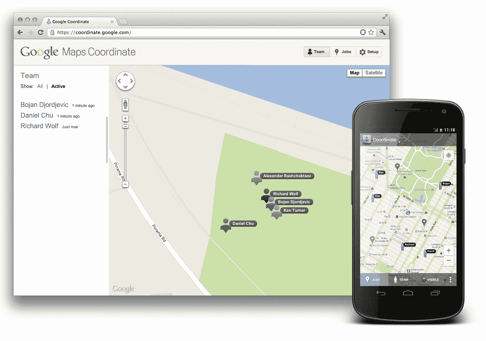

# 谷歌推出 Coordinate:管理移动员工的新服务 

> 原文：<https://web.archive.org/web/https://techcrunch.com/2012/06/21/google-coordinate-launch/>

在过去的几年里，像 Foursquare 这样的基于位置的应用和服务已经在消费者中取得了重大进展，但最近围绕基于位置的应用的大多数发展都绕过了商业市场。虽然有一些系统可以让企业跟踪他们的移动员工，但它们往往是专有的，而且价格昂贵。现在，谷歌正试图通过[谷歌地图坐标](https://web.archive.org/web/20221226001616/http://coordinate.google.com/)进入这个市场，这是一项将谷歌的地图和地理定位服务和 API 与移动劳动力调度系统相结合的服务，该系统可在网络、安卓手机和平板电脑上使用。谷歌表示，这将允许组织更有效地分配工作和部署员工。

在其核心，坐标允许企业派遣和跟踪他们的移动员工，无论他们是卡车或出租车司机，水管工或比萨饼送货员。谷歌自己一直在用校园交通服务对这项服务进行内部测试。

谷歌 Coordinate 产品经理 Dan Chu 上周在悉尼的办公室告诉我，这项服务背后的想法来自谷歌的企业客户，他们已经使用了谷歌的地图服务，但正在寻找一种更简单、现成的方式来组织他们的移动团队。在开发服务时，团队致力于使其尽可能灵活。大公司将能够在完整的读/写 API 的帮助下将 Coordinate 与他们现有的系统挂钩，但小企业也将能够使用它，而不必进行任何重大投资。

客户还可以将大型数据集作为定制位置输入到服务中。例如，公用事业公司可以用它来输入所有电线杆的位置。

正如朱棣文上周与我交谈时指出的那样，谷歌在地图和地理定位服务方面投入了大量资金，但这是谷歌第一次真正将所有这些投入到以商业为中心的应用程序中。

在调度方面，管理员将能够看到他们的工人在哪里，并把他们送到下一个地点。不在现场的员工将在地图上显示为蓝点。设置新帐户和用户只需点击几下鼠标。创建新工作也同样简单，管理员只需点击几下鼠标就可以设置新位置。

另一方面，在现场的员工将使用他们的移动电话接受新的工作，并向调度员发回报告。还有一个签到选项，允许用户确认他们已经到达他们的位置，例如，允许雇主区分旅行时间和完成一项工作的实际时间。该系统还允许管理员指定员工外出时必须收集的某些数据(例如，客户联系数据)。Chu 说，所有这些功能将允许管理员为他们的移动员工建立完整的工作流程。

鉴于此类服务的隐私影响，谷歌为用户建立了一个“隐身”选项，以及一个基于时间的系统，可以在用户轮班结束时自动注销用户。当用户第一次使用移动应用程序时，他们还必须非常明确地同意被跟踪。

谷歌推出这项服务的初始价格为 15 美元/用户/月，直到 2012 年 9 月 1 日。之后价格可能会上涨，但谷歌尚未发布任何相关信息。这项服务现在在全球范围内都可以使用，与谷歌通常的流程不同，它不被认为处于测试阶段。

[YouTube http://www.youtube.com/watch?v=0fluKWYRC_w&w=640&h=360]