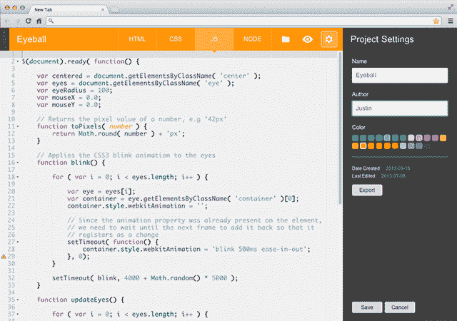

# Google Creative Lab 推出编码器，将 Raspberry Pi 转变为基本的网络开发平台 

> 原文：<https://web.archive.org/web/https://techcrunch.com/2013/09/12/google-creative-labs-launches-coder-to-turn-raspberry-pi-into-a-basic-web-development-platform/>

# 谷歌创意实验室推出 Coder，将 Raspberry Pi 变成一个基本的网络开发平台

谷歌创意实验室的新项目 Coder 是一个开源工具，它可以让你在基于网络的开发环境中轻松地将一个 Raspberry Pi 变成一个基本的网络服务器。这个工具是由谷歌的 Jason Striegel、设计师 Jeff Baxter 和纽约的一个小团队开发的，旨在为教育工作者和家长提供一个环境，教孩子们“构建网络的基础”

设置编码器应该只需要 10 分钟。该团队认为，该项目为学习者提供了一个构建网络程序的私人平台。对于那些已经知道编码的人来说，这也是一个很好的平台，并且提供了一个廉价的沙盒环境来试验新的想法。

【T2

要开始，你需要做的就是将[编码器安装程序](https://web.archive.org/web/20221006012209/http://googlecreativelab.github.io/coder/#download)下载到 SD 卡上，将其插入 Pi，并将浏览器指向 coder.local。该工具包括基于 web 的代码编辑器和开始构建基于 HTML、CSS 和 JavaScript 的应用程序所需的一切。

该团队表示，他们首先希望将 Coder 变成一个更完整的包，但后来决定只发布它，因为该团队认为“它越早进入开源和制造商社区，我们就越能了解它可能如何使用。”

随着 Raspberry Pi 售价 35 美元(外加几美元的电源和 Wi-Fi 加密狗)，Pi 提供了一个非常好的开发环境。虽然 Google 的这个项目主要是针对学习者的，但是如果他们把它变成一个功能更加全面的网络开发环境，我也不会感到惊讶。

[https://web.archive.org/web/20221006012209if_/https://www.youtube.com/embed/wH24YwdayFg?feature=oembed](https://web.archive.org/web/20221006012209if_/https://www.youtube.com/embed/wH24YwdayFg?feature=oembed)

视频