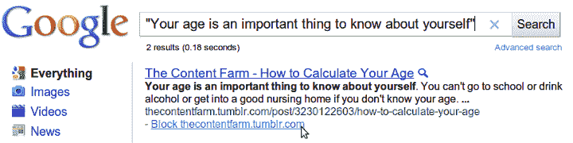
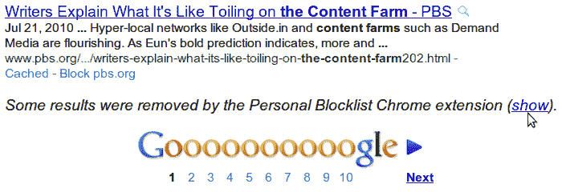

# 谷歌通过 Chrome 扩展将内容农场检测外包给了 

> 原文：<https://web.archive.org/web/http://techcrunch.com/2011/02/14/google-crowdsources-content-farm-detection-with-a-chrome-extension/>

# 谷歌通过 Chrome 扩展进行内容农场检测

除了删除给定域名的所有搜索结果，谷歌 Chrome 个人黑名单扩展还允许你查看哪些网站被屏蔽，并允许你通过点击浏览器右上角可爱的屏蔽图标来编辑你的名单。

> *“我们一直在探索不同的算法来检测[内容农场](https://web.archive.org/web/20230203015329/http://googleblog.blogspot.com/2011/01/google-search-and-search-engine-spam.html)，这是一些内容浅薄或质量低下的网站。我们正在探索的信号之一是来自用户的明确反馈。”*

因此，谷歌基本上是通过征求用户反馈来众包他们的内容农场检测算法，以研究作为搜索结果的*【潜在排名信号】*。嗯……这对谷歌来说是一个奇怪的举动，因为用户仍然必须找到扩展(不是每个人都阅读科技博客)，选择并不断编辑他们的结果，以提供任何有价值的数据。竞争对手的内容农场也有可能利用这个工具互相破坏。

竞争对手 [Blekko](https://web.archive.org/web/20230203015329/http://www.blekko.com/) 最近采取了[类似的步骤](https://web.archive.org/web/20230203015329/https://techcrunch.com/2011/01/31/blekko-bans-content-farms/)，根据 slashtag 编辑器的反馈，从搜索结果中完全屏蔽了 20 个最垃圾的网站。当时，这一举动更像是一种宣传噱头。

你可以在这里下载扩展[。](https://web.archive.org/web/20230203015329/https://chrome.google.com/webstore/detail/nolijncfnkgaikbjbdaogikpmpbdcdef)

http://twitter.com/#!/pkedrosky/status/37244418939420672