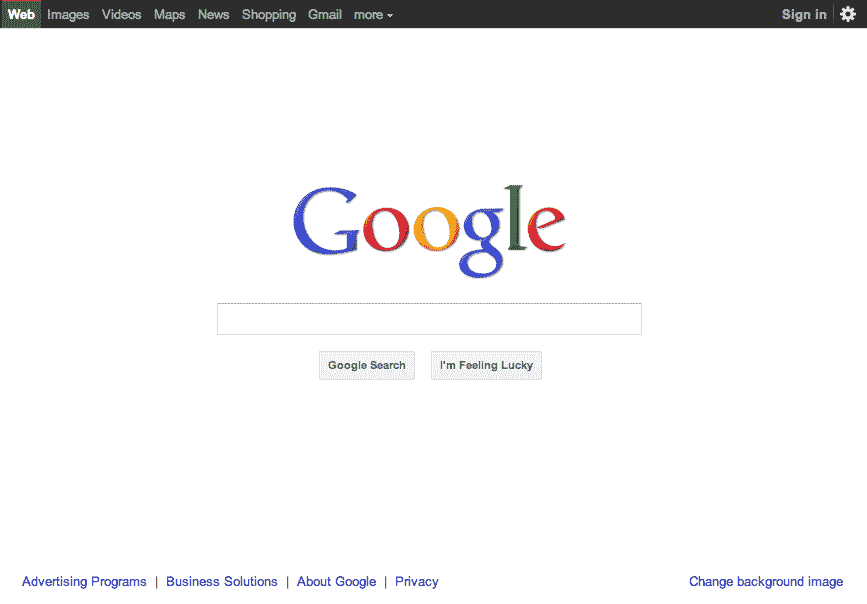
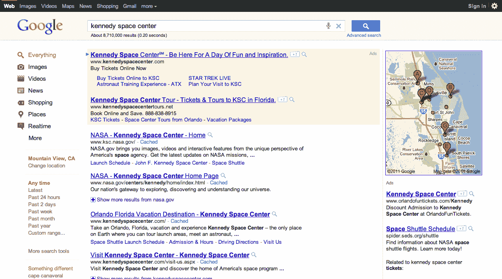

# 谷歌通过更新主页、搜索结果和免费字体获得所有设计

> 原文：<https://web.archive.org/web/http://techcrunch.com/2011/06/28/google-design-fhomepageonts/>

 哦，原来你以为谷歌推出 [Google+，Circles，Sparks，Huddle，Hangouts](https://web.archive.org/web/20230203082708/https://techcrunch.com/2011/06/28/google-plus/) 之后就完了？不，不，不。当你呼吸的是谷歌品牌的氧气时，谷歌就完成了。今天下午，搜索巨头的首次发布公告仍在继续，谷歌官方博客[悄悄宣布](https://web.archive.org/web/20230203082708/http://googleblog.blogspot.com/2011/06/evolving-google-design-and-experience.html)(相对而言)谷歌搜索页面(以及谷歌帝国的产品)将在接下来的几个月里“稍微改头换面”。还有新的网络字体。OMGoogle！

基本上，这些更新将专注于为谷歌产品增加增强的可用性、更简洁的设计和改进的 UX。虽然这些变化将在所有谷歌产品中展开，但看起来重点将是清理谷歌搜索、地图和 Gmail。根据它的博客，这种迭代背后的意图是成功地“提出对你来说重要的东西，并把所有其他乱七八糟的东西清理掉”。但这意味着什么呢？更具体地说，谷歌将为可操作的按钮添加更大胆的颜色，隐藏那些不重要的按钮，直到它们真正需要的时候，等等。

而且，正如你在下面看到的，结果页面也将会有一点新的外观。用户会发现一个新的灰色栏和一个蓝色的搜索按钮，以突出显示页面顶部的搜索框。哦，黑色的导航条怎么样？

搜索和结果的其他更新包括工具左侧面板的更新设计，谷歌在其中淡化了工具的颜色，并保留了使用更大胆的颜色来突出关键动作按钮、工具和过滤器。每个搜索结果的网址也将直接重新定位在标题下方，主页上的链接将移到浏览器的顶部和底部，所有这些都是为了清理搜索体验。

这些更新也是当今市场上大量小工具和设备的标志，坦率地说，也是谷歌在这些平台和设备上无处不在的标志。谷歌实质上正在推出更多的轻量级设计，将优化用于移动设备、高分辨率显示器、电视等。面对分裂，一致性就是一切。哦，谷歌还提到，作为这个新外观的一部分，也将有一些新技术投入使用，如 HTML5 和 WebGL，以命名两个熟悉的面孔。

谷歌也在增加它的免费开源字体——准确地说，是另外一百多种字体。所以，现在你可以搜索或浏览数百种字体系列，然后将它们添加到你的[谷歌字体集](https://web.archive.org/web/20230203082708/http://www.google.com/webfonts/v2#HomePlace:home)，在样本布局中查看它们，然后抓取谷歌提供的代码，将它们添加到你的网站。就这样。谷歌网页字体可以通过谷歌网页字体 API 获得，你可以在这里了解更多关于[的信息。](https://web.archive.org/web/20230203082708/http://code.google.com/apis/webfonts/)

但是‘会有漫画无二吗？’，你问。我无权说。