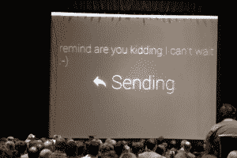
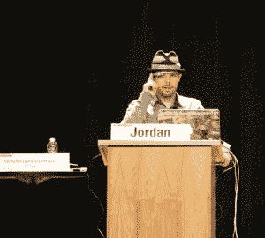

# 谷歌在 SXSW 展示 Glass Mirror API，展示 Gmail、NYT、Evernote 和 Path 集成技术

> 原文：<https://web.archive.org/web/https://techcrunch.com/2013/03/11/google-details-glass-mirror-api-at-sxsw-shows-off-gmail-nyt-evernote-and-path-integrations/>

在今天下午的 SXSW 上，谷歌向开发者提供了谷歌眼镜镜像 API 的第一印象，这是谷歌眼镜、谷歌服务器和开发者将为其编写的应用程序之间的主要接口。此外，谷歌展示了在谷歌眼镜上运行的第一轮应用程序，包括 Gmail 在该设备上的工作方式，以及与纽约时报、Evernote、Path 等公司的集成。

Mirror API 本质上是一个 REST API，对于大多数开发人员来说，这使得开发它变得非常容易。谷歌眼镜设备本质上是与谷歌的服务器和开发者的应用程序对话，然后从那里获取数据，并通过谷歌的 API 将其推送到谷歌眼镜。所有这些数据都通过谷歌所谓的“时间卡片”呈现在谷歌眼镜上。这些卡片可以包含文本、图像、丰富的 HTML 和视频。除了单卡之外，谷歌还允许开发者使用它所谓的捆绑，这基本上是一组卡，用户可以通过语音或眼镜侧面的触摸板进行导航。

下面是今天在 SXSW 上的玻璃演示的简短视频(通过 [@panzer](https://web.archive.org/web/20221206201733/http://twitter.com/panzer) ):

【YouTube http://www.youtube.com/watch?v=QrGVFMWvBSA？feature=player_detailpage]

 看起来共享到 Google+是镜像 API 的一个内置功能，但正如谷歌的 Timothy Jordan 在今天的演讲中指出的，开发者也可以随时添加自己的共享选项。其他内置功能似乎包括语音识别、摄像头接入和文本到语音引擎。

## 玻璃规则

乔丹还指出，因为谷歌眼镜是一种新的独特的外形，谷歌正在为谷歌眼镜应用程序制定一些规则。例如，它们不应该显示完整的新闻故事，而应该只显示标题，因为其他内容会太分散注意力。对于更长的故事，开发人员总是可以使用谷歌眼镜向用户阅读文本。

从本质上来说，开发人员应该确保他们不会用太多的通知来打扰用户，他们发送到 Glass 的数据应该总是相关的。乔丹说，开发者还应该确保在谷歌眼镜上发生的一切都是用户所期待的。他说，谷歌眼镜不是那种应用程序更新推送通知有意义的设备。

## 配合 Gmail、Evernote、Path 等使用谷歌眼镜

 作为今天演讲的一部分，乔丹还详细介绍了谷歌自己开发的一些谷歌眼镜应用，以及一些合作伙伴开发的应用。例如，《纽约时报》的应用程序会显示标题，然后让你通过告诉谷歌眼镜“大声朗读”来听文章摘要。谷歌自己的 Gmail 应用程序使用语音识别来回复电子邮件(它显然也会向你显示收到的邮件)。Evernote 的 Skitch 可以用来拍摄和分享照片，Jordan 还展示了一个在 Glass 上运行的社交网络 Path 的演示，来分享你的位置。

到目前为止，谷歌的任何网站上都没有关于镜像 API 的额外信息，但我们预计该公司将很快发布更多信息，一旦我们听到更多信息，我们将更新这个帖子。

*向 Engadget 的朋友们致敬，感谢他们对今天活动的[现场博客](https://web.archive.org/web/20221206201733/http://www.engadget.com/2013/03/11/google-glass-panel/)以及我们自己的 John Biggs 的照片。*