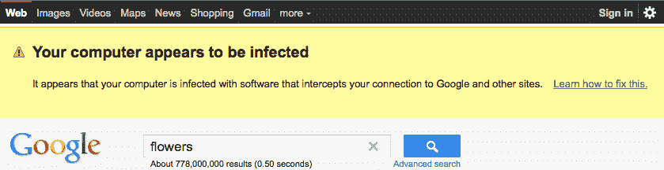

# 谷歌现在检测病毒，针对至少一种恶意软件 

> 原文：<https://web.archive.org/web/https://techcrunch.com/2011/07/19/google-detecting-viruses-from-their-end-for-at-least-one-form-of-malware/>

# 谷歌现在检测病毒，至少一种形式的恶意软件

谷歌[刚刚宣布了](https://web.archive.org/web/20230205012236/http://googleblog.blogspot.com/2011/07/using-data-to-protect-people-from.html)一件非常有趣的事情，它正在使用自己的数据来检测病毒，并将从今天起使用谷歌搜索结果页面来警告用户，如果他们的计算机感染了特定形式的恶意软件。感染该病毒的用户将会看到下面的警告，该病毒显然是通过代理将流量重新路由到谷歌和其他网站。

来自谷歌博客文章，神秘地标题为[“使用数据保护人们免受恶意软件的攻击”](https://web.archive.org/web/20230205012236/http://googleblog.blogspot.com/2011/07/using-data-to-protect-people-from.html):

> “最近，我们在对我们的一个数据中心执行日常维护时，发现了一些不寻常的搜索流量。在与发送这种修改流量的几家公司的安全工程师合作后，我们确定表现出这种行为的计算机感染了一种特定的恶意软件，即“恶意软件”。“由于这一发现，今天有些人会在他们的谷歌网页搜索结果的顶部看到一个突出的通知。”

谷歌的[马特·卡茨](https://web.archive.org/web/20230205012236/http://www.crunchbase.com/person/matt-cutts)在他的推特账户上提供了关于该病毒[的更多细节，显然它只影响 Windows 电脑并劫持谷歌搜索结果。“这就是我们如何得知的，”卡茨谈到“结果黑客”的事情，但没有提供更多细节。如果你收到通知，谷歌建议你遵循其](https://web.archive.org/web/20230205012236/http://twitter.com/#!/mattcutts/status/93476370629394432)[帮助中心](https://web.archive.org/web/20230205012236/http://www.google.com/support/websearch/bin/answer.py?answer=1182191)的建议。

这是主要搜索引擎第一次将其结果页面变成表面上的恶意软件警报。这当然符合公司的最大利益；如果代理拦截通信，他们也有可能访问谷歌账户，从而给谷歌带来更多麻烦。

