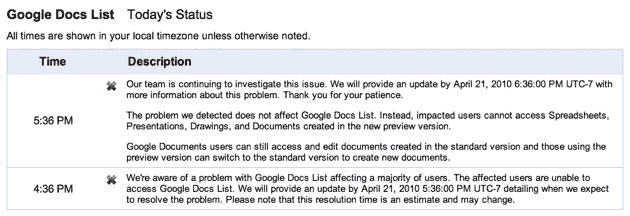

# Google Docs 只是选择了一个糟糕的失败时机(但有一个解决方案)

> 原文：<https://web.archive.org/web/https://techcrunch.com/2010/04/21/google-docs-just-picked-a-bad-time-to-fail-but-theres-a-fix/>

# 谷歌文档只是选择了一个糟糕的时间失败(但有一个修复)

今天的科技新闻被脸书开发者大会 f8 所主导，会上社交网络概述了一些新功能，这些功能可能有助于它成为网络的底层社交结构。当天宣布的一个消息是，脸书和微软已经与 T4 合作推出了 Docs.com，这是微软 Office 的一个在线版本，可以额外访问脸书的数据，使网站“即时社交化”。该网站最大的竞争对手——谷歌文档——对此消息的反应是关闭。很难。**更新**:谷歌的状态面板现在显示一切正常。

在过去的一个小时里，我们收到了许多举报 Google Docs 问题的提示。我无法创建电子表格。Twitter 搜索产生了无数个抱怨停电的人。

一小时前，谷歌更新了其应用状态面板，称其意识到了谷歌文档列表的问题。几分钟前他们又更新了一次。事实证明，受影响的不是列表，而是电子表格、绘图和文档。幸运的是，有一种方法可以解决这个问题:谷歌表示，这个问题只影响最近发布的[预览版谷歌文档的用户——使用屏幕顶部的选项切换回旧版本，事情应该会再次开始工作。以下是最新的状态更新:](https://web.archive.org/web/20221208174211/https://beta.techcrunch.com/2010/04/12/google-docs-realtime-google-drawings/)

> 我们的团队正在继续调查这个问题。我们将在 UTC-7 时间 2010 年 4 月 21 日下午 6:36:00 之前提供有关此问题的更多信息。谢谢你的耐心。
> 我们检测到的问题不影响谷歌文档列表。相反，受影响的用户无法访问在新的预览版本中创建的电子表格、演示文稿、绘图和文档。
> Google Documents 用户仍然可以访问和编辑在标准版本中创建的文档，使用预览版本的用户可以切换到标准版本来创建新文档。

