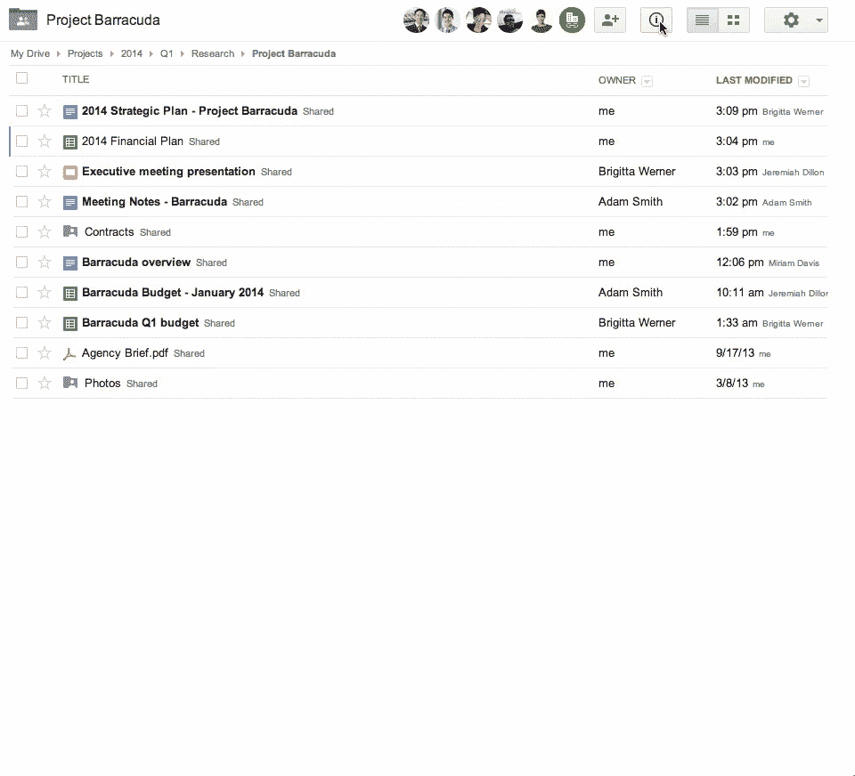

# Google Drive 增加了活动流，使跟踪共享文档的更改变得更容易 

> 原文：<https://web.archive.org/web/https://techcrunch.com/2014/01/14/google-drive-adds-activity-stream-makes-tracking-changes-to-shared-documents-easier/>

# Google Drive 增加了活动流，使跟踪共享文档的更改变得更加容易

Google today [向](https://web.archive.org/web/20230126215438/http://googleenterprise.blogspot.com/2014/01/a-new-activity-stream-in-drive-shows.html) [Google Drive](https://web.archive.org/web/20230126215438/https://drive.google.com/) 添加了一个活动流，最终使其用户更容易跟踪多个用户共享的文档的更改。谷歌表示，这项功能将在下周推出，所以可能要过几天你才能在你的账户上看到。

能够方便地与多个用户实时编辑文档是 Google Drive 始终脱颖而出的功能之一。不过，正如该公司所言，跟踪用户在这些文档中采取的所有行动实际上是不可能的。虽然大多数以文档为中心的服务，如 Podio 提供类似的流媒体服务，但谷歌从未提供这一功能，尽管谷歌专注于文档共享。

该流将跟踪编辑和评论，以及添加新电子表格、重命名文档和文件共享者等操作。

当您进入 drive now 时，您可以单击顶部导航栏中的新信息按钮，新的活动流将会弹出。

谷歌最近再次提高了更新 Drive 的速度。就在上个月，它增加了一个新的[下拉菜单](https://web.archive.org/web/20230126215438/https://plus.google.com/+googleenterprise/posts/SKUYbjiCaVR)，可以更容易地重命名文件夹，并重命名和组织它们。虽然这不是一个主要的新功能，但它确实使使用 Drive 变得更容易，就像今天的更新使它成为一个对团队更有用的解决方案一样。