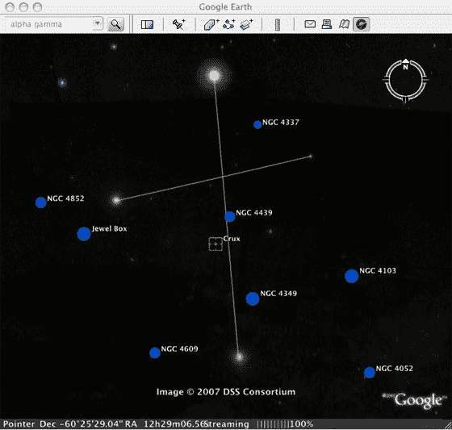
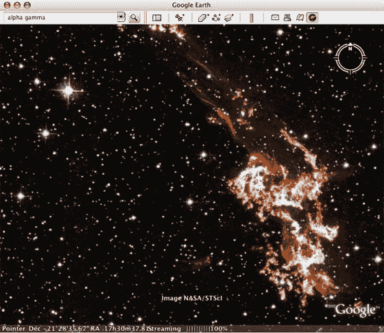

# 谷歌地球驶向星空 TechCrunch

> 原文：<https://web.archive.org/web/http://www.techcrunch.com/2007/08/22/google-earth-heads-for-the-stars/>

# 谷歌地球向星星进发

 谷歌为谷歌地球推出了天空，这是一项新功能，将星星的图像添加到谷歌地球已经广泛的地球图像中。

据[谷歌、](https://web.archive.org/web/20221203094104/http://google-latlong.blogspot.com/2007/08/sky-final-frontier.html)称，新功能允许用户“坐在舒适的椅子上探索宇宙”用户可以放大几亿光年之外的星系，探索星座，甚至见证超新星爆炸。

太空图像包括来自各种来源的 100 多万张照片，包括斯隆数字巡天、加州理工学院的帕洛马天文台和哈勃望远镜。

人们常说，谷歌地球和谷歌地图将制图带到了大众面前，Sky 也可以为天文学做同样的事情。

要访问 Sky，用户必须下载最新版本的谷歌地球。

 