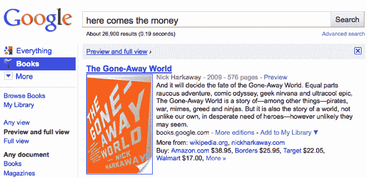

# 谷歌版:分而治之 TechCrunch

> 原文：<https://web.archive.org/web/http://techcrunch.com/2010/12/01/google-editions-divide-and-conquer/>

[电子阅读](https://web.archive.org/web/20230203025359/http://www.crunchgear.com/tag/e-readers/)之战正在白热化，尽管[的统计数据表面上显示 iPad](https://web.archive.org/web/20230203025359/http://www.crunchgear.com/2010/11/30/report-shows-ipad-gaining-on-kindle-in-e-reader-category/) 销量不佳，但市场的波动显而易见。Kindle 充分利用了早期的领先优势，有望成为非常受欢迎的礼物。Nook Color 获得了令人鼓舞的评价，并且刚刚扎根于[市场，成为平板电脑消费者的节俭选择。彩色电子墨水即将问世。成为一名电子书销售商是一个光荣的时代。](https://web.archive.org/web/20230203025359/http://www.crunchgear.com/2010/11/29/hacknooks-part-deux-nook-color-rooted/)

所以毫不奇怪，谷歌加入了期待已久的谷歌版本服务的竞争，该服务将于今年年底在美国推出，2011 年第一季度在全球推出。但是在 Kindle，Barnes & Noble，Kobo，iBooks，以及像亚马逊的 DTP 和不幸命名的 Pubit 这样的独立出版服务之间，还有其他玩家的空间吗？这并没有阻止任何人的尝试——但我认为在这种情况下，谷歌可能会带来一些新的东西:去中心化。

我确信，谷歌知道，与类似 Kindle 的服务直接竞争对谷歌版来说无异于自杀。亚马逊和其他公司已经成功创造了一个实体的拟像。你去虚拟的 Barnes & Noble 就像你去真实的 Barnes & Noble 一样，你浏览网站就像你浏览商店一样，你看到书，你看封面，你读几页。虚拟商店的成功是不可否认的，它将继续取得成功。试图硬塞进另一个领域，就像苹果公司成功与否参半一样，是谷歌不适合的项目。说实话，他们对那种事情很不擅长。

但是他们擅长创造一些人们会在不知不觉中使用的东西，他们擅长收集和组织信息。Google Editions 不会是一个更简朴的网络美学的 Kindle 商店:它将是一个个人网络，由 Google 索引、管理和定期挤奶。虽然这些条款鼓励卖家通过谷歌现有的服务进行销售(我猜是结账、从搜索中直接推荐等)，但转售商的收入分成仅略有下降。意思很清楚:谷歌想要建立一个书商大军，直接向访问他们网站、博客或诸如此类的用户销售图书。

例如，在销售你的书时，不需要通过亚马逊的优势是很难量化的。但是，作者可以在自己的页面上放置一个小部件，并让购书交易独立存在，而不是转移到亚马逊，这一想法意义重大。对许多人来说，作为一个独立节点的吸引力将是有吸引力的，因为其他电子书商店的条款可能不够宽松或可定制。正如伊利诺伊州出版商 Sourcebooks Inc .的 Dominique Raccah 所说，“谷歌将把每一个谈论一本书的互联网空间变成一个你可以买到那本书的地方。”

随着向自助出版的重大转变，以及可以理解的对其货币化的推动，谷歌版本可能会进入一个不断扩大的市场的开端。集中式商店当然会继续流行，但网络正在成为发现引擎，部分原因是谷歌本身，这使他们在这类事情上处于不可否认的有利地位。他们不打算搞垮亚马逊，但如果虚拟书店模式垮了，他们打算留在那里。

谷歌描述的实际电子阅读平台没有这么好。如上所述，亚马逊作为电子书设备和销售的市场领导者拥有巨大的优势，甚至没有(像苹果可能做的那样)利用这一地位强迫消费者购买他们的硬件。正如评论者昨天在 [iPad/Kindle 的故事](https://web.archive.org/web/20230203025359/http://www.crunchgear.com/2010/11/30/report-shows-ipad-gaining-on-kindle-in-e-reader-category/)中指出的，在那次调查中被确定为电子阅读器的许多 iPad 有可能甚至很可能运行 Kindle 软件。亚马逊知道这两种服务都可以独立生存，因为 Kindle 可能是市场上最好的电子阅读器设备，Kindle 商店是最熟悉和整合良好的电子书市场。他们*想让*人买 iPads！越多的人阅读电子书，越多的人购买电子书，亚马逊肯定在努力获得独家内容，T4 甜心与出版商交易。

随着时间的推移，Android 版本号的上升和 Chrome OS 设备的发布可能会让我们对阅读平台有所了解，但就目前而言，它似乎是一种网络绑定服务，或许最好向谨慎的消费者解释为电子书的 Gmail。我不能说我对这种东西特别感兴趣，尽管现在就为它烦恼还为时过早，因为它不仅没有发布，而且在上线时很可能仍然是未加工的。一旦产品实际上市，我们将单独进行评估。如果你想知道这是否会影响你应该给配偶买哪个电子阅读器，答案是不，不会。不用找替代礼物了。

还有与其他服务的交叉兼容性问题。你还不如问问你的云战车有没有个人独角兽。这些服务正在竭尽全力将图书保留在他们的生态系统中，在官方允许大公司之间的拖放支持之前，还需要一段时间。技术问题也比比皆是:虽然我一直在我的 iPad 上阅读谷歌图书 PDF，但图像是用 JPEG 2000 编码的，iOS 不支持 JPEG 2000，所以我收藏的大部分*绅士杂志*都是空白的(专业提示:在预览中重新保存 PDF 可以解决这个问题)。很遗憾苹果不支持这种图像格式——但是我跑题了。关键是技术标准以及数字版权等问题都需要解决。

谷歌版本新闻紧随谷歌、作家协会和美国出版商协会的一项重大声明之后，大意是他们已经解决了长期存在的问题，并将在这项服务上进行合作。公告详情可以在[这里](https://web.archive.org/web/20230203025359/https://sites.google.com/a/pressatgoogle.com/googlebookssettlement/key-benefits-of-the-settlement)和[这里](https://web.archive.org/web/20230203025359/http://books.google.com/googlebooks/agreement/)找到；要点似乎是，关键参与者已经同意了任何收入分享、捐赠、法律权利等等，以换取谷歌对其内容的访问权。既然喧嚣已经结束，谷歌可以满怀信心地启动了。

恐怕对谷歌来说，利用假期为时已晚，尽管我们可能会期待本月晚些时候的软发布。事实上，公平地说它已经启动，因为许多[条款](https://web.archive.org/web/20230203025359/https://books.google.com/partner/online-ge-terms)、[细节](https://web.archive.org/web/20230203025359/http://books.google.com/support/partner/bin/answer.py?hl=en&answer=167975)和[政策](https://web.archive.org/web/20230203025359/http://books.google.com/support/partner/bin/answer.py?answer=166501)已经公布。不过，随着谷歌使其设备和平台战略更加清晰，我们肯定会在未来几个月听到更多消息。