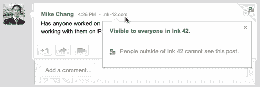
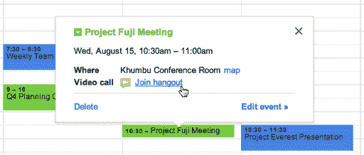

# 随着面向企业的 Google+的公开亮相，谷歌进入了社交企业领域，2013 年免费 

> 原文：<https://web.archive.org/web/https://techcrunch.com/2012/08/29/google-enters-the-social-enterprise-with-public-debut-of-google-for-businesses-free-through-2013/>

# 随着面向企业的 Google+的公开亮相，谷歌进入了社交企业领域，免费服务将持续到 2013 年

继去年 10 月谷歌开始允许谷歌应用套件用户访问 Google+后，该公司今天宣布了几项旨在将谷歌品牌的社交体验更深入商业世界的新功能。具体来说，该公司正在推出对受限共享选项的支持，与 Gmail、Calendar 和 Docs 等其他谷歌产品集成的视频会议，以及 Google+内部的额外管理控制，今天公开推出了 Google+的企业产品。

谷歌的企业副总裁阿米特·辛格[在 12 月告诉 TechCrunch](https://web.archive.org/web/20221210061751/https://beta.techcrunch.com/2011/12/24/watch-out-yammer-and-jive-google-is-about-to-enter-the-social-enterprise-space/)公司已经在内部使用 Google+作为协作平台，并承诺在 2012 年将 Google+引入企业市场。“Google+是企业的下一件大事，”他当时说。“我们将对 Google+和 Gmail 以及其他面向消费者的应用做同样的事情，以便 Google+可以在更多的企业环境中被采用。”

今天，谷歌应用程序[的产品管理总监 Clay Bavor 在谷歌企业博客](https://web.archive.org/web/20221210061751/http://googleenterprise.blogspot.com/2012/08/bringing-google-to-work.html)上写道，谷歌现在准备将 Google+企业版的一些功能转移到“完整预览”模式，这意味着任何采用谷歌应用程序的组织现在都可以免费试用这些功能，直到 2013 年底。这是一个关键信息，因为它暗示谷歌确实计划最终对社交协作工具收费，就像它今天对其在线生产力工具收费一样，包括 Gmail、Calendar 和 Docs。鉴于 Google+与其他商业友好型产品的紧密结合，谷歌已经在这一市场取得了进展。

巴沃尔说，现在推出的初始工具只是几个工具中的第一个，他补充说，谷歌将继续及时添加更多的功能和管理控制。他说，一些公司已经在对企业功能进行试点测试，包括[卡普兰](https://web.archive.org/web/20221210061751/http://googleenterprise.blogspot.com/2012/08/kaplan-tests-high-with-google-apps-for.html)和[女妖酒](https://web.archive.org/web/20221210061751/http://youtu.be/ZyMEEdE39EM)。

至于今天到底向所有 Google Apps 用户开放了什么？首先是私人共享，允许用户将帖子标记为“受限”，使其成为组织的私人帖子，并且不允许在外部重新共享。如果需要，这些帖子也可以与外部合作伙伴或同事分享。

视频会议(在谷歌行话中也称为“Hangouts”)是一种群组聊天功能，允许多达 10 名用户通过网络摄像头或智能手机进行面对面聊天，现在已经与谷歌应用程序用户的谷歌应用程序、日历和文档中的 Gmail 集成在一起。像上面的私人分享功能一样，这不仅仅是一个商业选项——例如[谷歌在 7 月](https://web.archive.org/web/20221210061751/https://beta.techcrunch.com/2012/07/30/google-replaces-gmail-video-chat-with-google-hangouts/)将 Google+ Hangouts 添加到 Gmail 中。谷歌日历中的[也支持](https://web.archive.org/web/20221210061751/http://support.google.com/calendar/bin/answer.py?hl=en&answer=2690797)视频聊天。

最后，Bavor 谈到了针对商业用户的额外管理控制。至少从 it 的角度来看，这是这项服务最关键的部分。与 Google Apps 一样，Google+的管理控件允许公司设置帖子限制的默认值，并且可以为私人公司会议启用受限的聚集区。关于定价和下一步计划的细节还不清楚，但在社会企业领域工作的公司——包括 Jive、微软收购的 [Yammer](https://web.archive.org/web/20221210061751/https://www.yammer.com/) 和[sales force](https://web.archive.org/web/20221210061751/https://beta.techcrunch.com/2011/08/30/salesforce-adds-realtime-chat-screen-sharing-social-customer-groups-to-chatter-debuts-html5-mobile-app/)——正在受到关注。