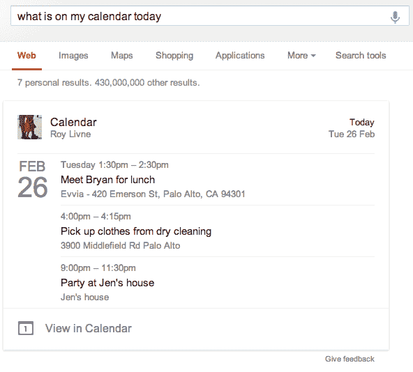

# Google 扩大搜索领域试验，将您日历中的结果纳入其搜索结果页面 

> 原文：<https://web.archive.org/web/https://techcrunch.com/2013/02/27/google-expands-search-field-trial-to-include-results-from-your-calendar-on-search-results-pages/>

# Google 扩展了搜索域试验，将您日历中的结果包含在其搜索结果页面上

谷歌刚刚[宣布](https://web.archive.org/web/20221005154532/https://plus.google.com/103345707817934461425/posts/ErwBtcXptdw)参与其 [Gmail 和 Google.com 搜索栏试用](https://web.archive.org/web/20221005154532/https://www.google.com/experimental/gmailfieldtrial)的用户现在也可以在谷歌的搜索结果页面上看到他们个人日历的结果。您可以通过使用类似[我的日历上今天有什么]和[我什么时候见 rip]这样的查询来查看这些结果。

顺便说一下，实地试验本身其实并不新鲜。谷歌已经运行它有一段时间了，它对任何有兴趣尝试这些个性化搜索功能的人开放。

最近，谷歌还在这项测试中添加了关于您即将到来的航班、餐厅和酒店预订以及预定活动的信息。为了显示这些结果，谷歌会扫描你的 Gmail 收件箱，寻找来自 OpenTable、Ticketmaster、Eventbrite 和其他网站的相关邮件。当然，这些信息中的一部分也被用来驱动 Google Now。

正如谷歌负责谷歌搜索的高级副总裁阿密特·辛格哈尔在公司第一次[介绍](https://web.archive.org/web/20221005154532/http://googleblog.blogspot.com/2012/08/building-search-engine-of-future-one.html)这一现场试验时指出的，“有时你的问题的最佳答案并不在公共网站上——它可能包含在其他地方，比如在你的电子邮件里。”

谷歌可能会暂时继续提供这些功能作为选择加入的“实地试用”，原因是它显然需要将你的搜索结果、Gmail 收件箱和日历连接起来，才能在 Google.com 上显示这些结果。毕竟，不是每个人都会对谷歌扫描和使用他们收件箱和日历中的信息感到舒服。

与之前所有的现场试用版一样，它只提供英语版本，并且只面向拥有 gmail.com 地址的美国用户。遗憾的是，这也意味着你的 Google Apps 工作账户的日历结果不会很快出现在 Google Search 上。

