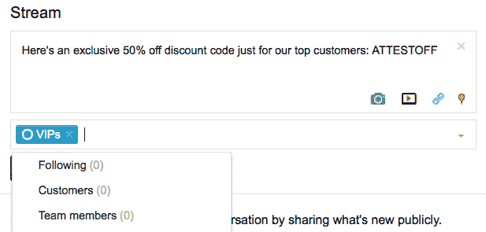
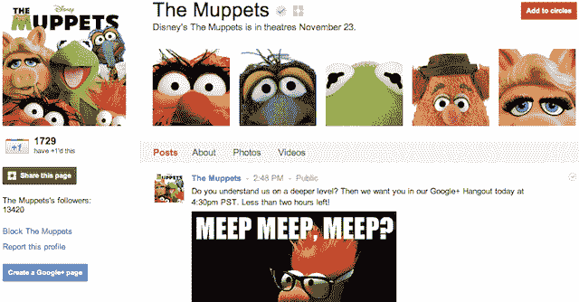

# Google+如何超越脸书的品牌页面

> 原文：<https://web.archive.org/web/https://techcrunch.com/2011/11/07/google-facebook-pages/>

Google today [发布了 Google+品牌页面](https://web.archive.org/web/20230205030836/https://techcrunch.com/2011/11/07/google-launches-pages-opens-floodgates-for-brands-and-everything-else/)产品的第一次迭代。该公司需要做出一些重大选择，如何充实这个框架，以挑战脸书多年来致力于开发的页面产品。尽管如此，现在比较这两种品牌存在的愿景可以让我们了解 Google+页面产品路线图的下一步可能是什么，以及谷歌有哪些机会来利用脸书推广其应用平台和吸引广告收入的需求所带来的弱点。

Google+让其页面优于脸书的两个核心方法是，让品牌针对其追随者的人口统计子集进行更新，以及提供官方应用模板，让品牌能够轻松组装自己的定制应用，而不是通过第三方开发商。

### 页面设置

在接下来的几天里，谷歌计划给予所有用户创建页面的能力。不过，现在的推出有点混乱，因为每个现有页面都有一个“创建 Google+页面”链接，这突然阻止了一些用户，告诉他们实际上还不能这样做。

与脸书类似，谷歌目前提供一些总体类型的页面，这些页面可以细分为许多子类别，根据搜索引擎 Land 的说法是[。两者都包括一种特殊的格式，允许当地企业列出地址和电话号码等信息。关于如何选择正确的类别以及该选择将如何影响功能，脸书提供的指导很少。一个更好的在线页面创建教程可以让 Google+上的品牌不用担心他们已经搞砸了关键的第一步。](https://web.archive.org/web/20230205030836/http://searchengineland.com/google-pages-now-open-for-businesses-brands-places-more-100217)

Google+页面缺乏定制的虚荣心网址，尽管你可以假设这一点即将到来。据报道，多管理员支持正在进行中。为管理员分配不同角色和权限的选项，如发布更新或删除其他管理员的能力，可以使 Google+页面更安全，更易于团队管理。

### 关注和发布

正如 Jason Kincaid 在他关于 Pages 发布的文章中指出的那样(链接见上)，谷歌令人困惑地让用户既可以在他们的圈子中添加一个页面，也可以+1 它。前者意味着用户将开始在其主流和他们添加页面的任何圈子的流中看到页面的更新，而后者允许用户共享页面的链接。如果谷歌希望页面获得足够多的追随者，让品牌通过它们投入资源进行发布，那么它需要让跟随页面成为一种明显而直接的体验。

谷歌+页面的一个重要特征是直接连接，它允许用户通过搜索谷歌上的+[品牌名称]来为他们的圈子添加一个页面。这比必须访问脸书页面才能喜欢它要少得多的工作。Direct Connect 还建立在谷歌在搜索领域的主导地位之上——它应该在电子邮件和地图等其他领域加以利用，以使其社交网络与众不同。

谷歌+页面的另一个潜在优势是，他们可以创建自己的圈子，然后被选为帖子的受众。目前，谷歌创建了“贵宾”、“客户”和“团队成员”圈，管理员可以填充。如果谷歌提供了一种有效而准确的方式，将关注者按照年龄、位置和其他特征分类到圈子里，佩奇可以向不同的受众群体发布不同的更新，以最大限度地提高这些更新的相关性。

例如，如果零售商梅西百货能够向所有 30 岁以下的追随者发布更新，它就可以为年轻受众提供更年轻产品的更新，而不会惹恼年长的追随者。同样，与其为他们在不同城市的存在创建单独的谷歌+页面，品牌可以发布针对城市的当地促销更新，当地企业可以发布针对邻近地区的邮政编码更新。脸书目前只允许 Pages 按国家、城市和语言定位帖子，阻止了年龄或更精细的邮政编码定位。

Google+用户可以对页面的帖子发表评论，但不能直接张贴到页面的墙上。他们可以在自己的更新中提到一个页面，只需在页面名称前直接输入一个“+”，但这不会像脸书提到的那样出现在页面上。能够在他们的墙上张贴问题和反馈，并与管理员和其他粉丝进行讨论，这使得脸书页面成为一个新的客户服务渠道，品牌不能忽视。Google+应该仔细考虑它希望网页成为多大程度的双向交流媒介。

截至目前，似乎还没有谷歌+页面管理分析的迹象。能够衡量帖子的参与度和页面增长对于品牌证明向 Google+分配资源是至关重要的，因此它将在某个时候需要自己版本的脸书页面洞察。目前保持页面性能不透明的决定可能是为了防止品牌在谷歌认为它已经获得足够多的用户之前放弃新的社交网络。

### 托管应用程序

除了新闻源帖子，脸书页面吸引用户和新粉丝的一个关键驱动力是托管应用程序的能力。Pages 使用这些应用程序创建鼓励点赞的登录页面、电子邮件和移动营销的注册表单、竞赛和抽奖、游戏以及电子商务店面。然而，要创建这些应用，页面管理员必须从第三方开发者那里寻找解决方案，在某些情况下，还必须许可页面管理平台提供他们想要的应用。

谷歌有机会通过创建官方模板来使所有企业更容易访问页面应用程序，这些模板可以根据品牌所需的图像、副本和功能进行定制。与其强迫管理员在未知的第三方开发的应用中做出选择，不如给他们免费的模板，让他们可以放心使用。这也将允许 Google+提供页面应用，而无需首先创建一套强大的 API 来支持它们。

脸书为社交网络上的品牌形象打造了一个功能模型。不幸的是，它对应用程序开发者的关注，以及它希望获得品牌广告以瞄准特定人群的愿望，给谷歌留下了一些为品牌创造更友好平台的巨大机会。通过添加应用程序模板和针对它的精细页面更新，可以让品牌相信 Google+可能是他们数字营销战略中一个强大、免费和易于采用的组成部分。

