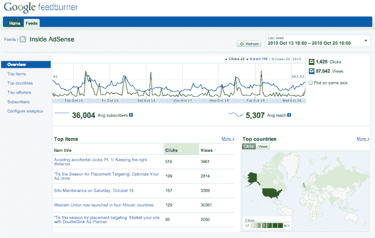

# 谷歌终于更新了 FeedBurner，专注于实时统计数据和 Twitter TechCrunch

> 原文：<https://web.archive.org/web/https://techcrunch.com/2010/10/25/google-feedburner-twitter/>

# 谷歌最终更新了 FeedBurner，专注于实时统计和 Twitter

三年半前，谷歌完成了一笔看起来相当大的 1 亿美元的收购 : FeedBurner。你记得那家公司吧？在所有实时技术出现并使其对许多人来说变得过时之前，他们是主宰 RSS 管理的人。今天，谷歌将实时拨片放入 FeedBurner 的心脏，试图激活它。

如果你今天访问 FeedBurner，你会看到一个“试试我们的新(测试)版本！”顶部菜单中的消息。点击这个会把你带到新的版本。有什么新鲜事吗？整个外观和感觉已经过改进。新的主页屏幕会加载您运行的站点的概览统计信息和警报。但是真正的关键当然是在 Feeds 区域。

在这里，你会看到一种全新的方式来看待你的用户和数据。这一举动应该不会让任何人感到惊讶，它看起来更像谷歌分析。但关键是幕后发生了什么。正如谷歌[指出的](https://web.archive.org/web/20221207030552/http://adsenseforfeeds.blogspot.com/2010/10/your-stats-right-away.html):

> 然而，真正的故事是引擎盖下的新内容:新界面提供了点击量、浏览量和播客下载量的实时统计数据，这意味着你可以开始看到什么内容正在吸引 feed 阅读器、Twitter 和其他辛迪加来源的流量。

事实上，谷歌在关于更新的帖子中几次提到 Twitter，比他们提到自己的 RSS 阅读器产品 Google Reader 还多。显然，他们看到了内容消费的未来走向。

有趣的是，Twitter 在这里非常重要。FeedBurner 的联合创始人之一兼首席执行官是[迪克·科斯特罗](https://web.archive.org/web/20221207030552/http://www.crunchbase.com/person/dick-costolo)——是的，就是现在[Twitter](https://web.archive.org/web/20221207030552/https://beta.techcrunch.com/2010/10/04/twitter-ceo-dick-costolo/)的首席执行官。

2009 年 7 月，科斯特洛离开了谷歌，此前他已经离开了 FeedBurner 团队。对我们许多人来说，收购后，谷歌没有把它应该有的资源投入到产品中，这一点似乎很清楚。它在谷歌的时间充满了错误、问题和大多数用户越来越不感兴趣。

也许现在这种情况会改变。也许吧。这次更新大约晚了两年。

*【感谢[迈克尔](https://web.archive.org/web/20221207030552/http://www.websonic.nl/)*