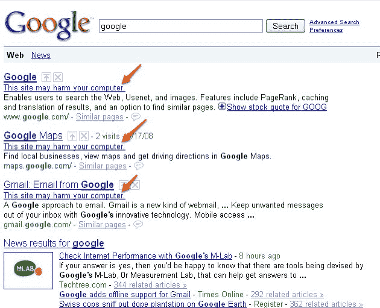
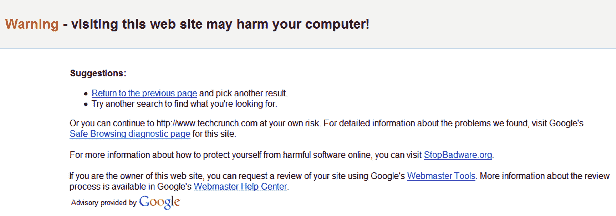

# 谷歌将整个互联网标记为恶意软件

> 原文：<https://web.archive.org/web/https://techcrunch.com/2009/01/31/google-flags-whole-internet-as-malware/>

# 谷歌将整个互联网标记为恶意软件

我们不太清楚发生了什么，但几分钟前，谷歌的任何搜索结果都开始被标记为恶意软件，并显示一条消息称“该网站可能会损害您的计算机”。包括你在上面看到的谷歌自己的网站。

推特上[充斥着](https://web.archive.org/web/20230222212607/http://search.twitter.com/search?q=google+search)人们报告的重大错误(也要寻找标签[# Google may harm](https://web.archive.org/web/20230222212607/http://search.twitter.com/search?q=%23googmayharm)或[# Google may hem](https://web.archive.org/web/20230222212607/http://search.twitter.com/search?q=%23googmayhem)),很明显这在世界各地都在发生。显然，任何平台上的任何浏览器都会出现这种情况。

点击这条信息会把人们带到来自谷歌的支持页面(下图)，但是现在这个页面受到了数百万人的狂轰滥炸，所以它的反应非常慢。我简单地看了一下页面，它指向了[StopBadware.org](https://web.archive.org/web/20230222212607/http://www.stopbadware.org/)(很明显它现在也加载缓慢或者根本不加载)。

**更新:**好像在自我修复。我在 Google Belgium 上没有问题了，但是当我搜索 Google.com 时，仍然会收到恶意软件的警告信息。此外，它似乎只发生在你现在作为登录用户搜索的时候。

**更新二:**现在好像没事了。持续了大约 15 分钟(谷歌说这个窗口更像是 55 分钟)。你现在可以深呼吸，然后继续你之前在做的事情:)

现在我们只需要等待谷歌告诉我们哪里出了问题。很明显，这种规模的崩溃，无论有多短暂，都将成为未来几天的讨论话题(我敢打赌，不仅仅是在谷歌总部)。

**更新 3:** 玛丽莎·梅耶尔现在已经在[谷歌官方博客](https://web.archive.org/web/20230222212607/http://googleblog.blogspot.com/2009/01/this-site-may-harm-your-computer-on.html)上解释了这个错误。她认为这是人为错误，因为非营利组织 StopBadware.org[向谷歌](https://web.archive.org/web/20230222212607/http://stopbadware.org/)发送的更新中错误地出现了一个“/”(该非营利组织还发布了[更多细节](https://web.archive.org/web/20230222212607/http://blog.stopbadware.org/2009/01/31/google-glitch-causes-confusion))。结果是谷歌数据库中的每个网址都被归类为“恶意软件”，直到杂散的“/”被删除。

以下是 Mayer 的官方帖子:

> 如果你在太平洋标准时间早上 6:30 到 7:25 之间用谷歌搜索，你可能会看到“这个网站可能会损害你的计算机”的信息伴随着每一个搜索结果。这显然是一个错误，我们非常抱歉给我们的用户造成不便。
> 发生了什么？很简单，人为错误。如果已知该网站在后台或以其他方式偷偷安装恶意软件，Google 会用消息“该网站可能会危害您的计算机”来标记搜索结果。我们这样做是为了保护我们的用户不访问可能会损害他们计算机的网站。我们与一家名为 StopBadware.org 的非营利机构合作，获取我们的网址列表。StopBadware 仔细研究每个消费者的投诉，以公平地决定该网址是否属于该名单。因为每个案例都需要单独研究，所以这个列表是由人类维护的，而不是算法。
> 
> 我们定期收到该列表的更新，并于今天上午在网站上发布了一个这样的更新。不幸的是(这是人为错误)，“/”的 URL 被错误地作为一个值签入到文件中，并且“/”扩展到所有的 URL。幸运的是，我们的待命站点可靠性团队很快发现了问题并恢复了文件。由于我们以交错和滚动的方式推送这些更新，错误在上午 6:27 到 6:40 之间开始出现，并在上午 7:10 到 7:25 之间开始消失，因此任何特定用户的问题持续时间大约为 40 分钟。
> 
> 感谢我们的团队快速找到了这个。再次向今天早上给你们带来不便的人，以及网页被错误标注的网站所有者道歉。我们将仔细调查这一事件，并采取更强有力的文件检查措施，以防止此类事件再次发生。
> 
> 谢谢你的理解。
> 
> 由搜索产品和用户体验副总裁 Marissa Mayer 发布