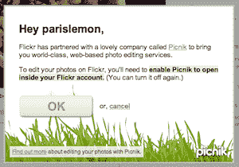

# 谷歌:Flickr 可以继续用 Picnik。雅虎:我们无可奉告。TechCrunch

> 原文：<https://web.archive.org/web/https://techcrunch.com/2010/03/01/google-flickr-yahoo-picnik/>

# 谷歌:Flickr 可以继续用 Picnik。雅虎:我们无可奉告。

今天早些时候，在关于[谷歌收购照片编辑服务 Picnik](https://web.archive.org/web/20221005230505/https://beta.techcrunch.com/2010/03/01/google-buys-up-online-photo-editing-site-picnik/) 的文章中，我们注意到这次收购最有趣的事情可能是 [Picnik](https://web.archive.org/web/20221005230505/http://www.picnik.com/) 目前是 Flickr 的默认照片编辑器。听到这个消息后，我们联系了谷歌和雅虎(拥有 Flickr ),看看这对双方合作的未来意味着什么。回答很有趣。

谷歌方面表示，它将允许第三方网站(包括 Flickr)继续与其整合。这是他们发给我们的声明:

> 我们相信开放永远是最好的方法，并允许第三方网站继续与 Picnik 集成。人们应该能够从其他照片共享网站拉照片，用 Picnik 进行编辑，并保存到他们选择的任何网站。

听起来不错，对吧？好吧，听起来没人愿意告诉雅虎。以下是他们的声明(来自负责雅虎公关的 OutCast Communications):

> 谢谢你的联系。在这一点上，我们没有对收购的评论，但会让你知道，如果我们有信息分享。

如果雅虎要继续 Picnik 的关系，你不认为他们会站出来说出来吗？或者至少说类似这样的话，“在这个时候，我们看到关系在继续。”相反，看起来他们可能正在权衡自己的选择。或者他们只是还不知道收购会对事情产生什么影响。

问题是 Picnik 是目前在 Flickr 上完成大部分编辑工作的唯一途径。没有它，整个产品的价值就会降低。那么雅虎必须建立自己的图片编辑器吗(显然他们之前反对，否则他们会这么做而不是与 Picnik 合作)？或者他们会和其他人合作——也许是[鸟舍](https://web.archive.org/web/20221005230505/http://aviary.com/)？

不管怎样，谷歌有收购公司，然后让他们的产品枯萎的历史(躲避球，Jaiku 等)。让我们希望情况不是这样，Picnik 至少可以集成到 Picasa(谷歌的在线照片服务)中，因为它是一项可靠的服务。