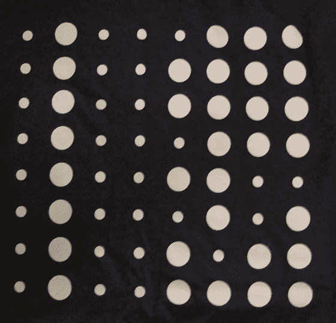

# 谷歌迷上了谷歌 I/Ot 恤。太花哨了 

> 原文：<https://web.archive.org/web/https://techcrunch.com/2008/05/28/google-gets-fancy-with-google-io-tshirts-too-fancy/>

# 谷歌迷上了谷歌 I/Ot 恤。太花哨了

谷歌有数千名工程师，你可能会认为有人会说二进制的 T2 语。但也许不是。今天，[谷歌 I/O](https://web.archive.org/web/20230218182640/https://techcrunch.com/2008/05/28/live-from-google-io/) 大会的与会者收到了一件 t 恤，上面应该用二进制拼出 GOOGLEIO。只有一个问题，实际的信息打印拼写谷歌:

G:01000111
O:01001111
O:01001111
G:01000111
L:01001100
E:01000101
K:01001011
O:01001111

本该代替" K "的" I "应该是 01001001。

如果你有一个这样的，那就省省吧。现在绝对是收藏家的物品了。如果有人卖的话，我出 50 美元买一件加大码的。

在这里自己检查——记住大小写字母有不同的二进制拼写。谢谢你的提示，兰迪。