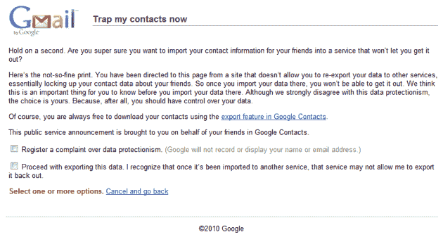

# 谷歌变得好斗，将与脸书的数据可移植性之战提升了一个档次

> 原文：<https://web.archive.org/web/https://techcrunch.com/2010/11/10/google-gets-feisty-kicks-data-portability-fight-with-facebook-up-a-notch/>

# 谷歌变得好斗，将与脸书的数据可移植性之战提升了一个档次

我相信你现在已经知道了，谷歌最近[阻止了脸书 API 访问](https://web.archive.org/web/20230403165507/https://techcrunch.com/2010/11/04/facebook-google-contacts/)来下载谷歌联系人。脸书[绕过了那个](https://web.archive.org/web/20230403165507/https://techcrunch.com/2010/11/08/facebook-finds-a-new-way-to-liberate-your-gmail-contact-data/)，谷歌随后发表声明说他们[【失望】](https://web.archive.org/web/20230403165507/https://techcrunch.com/2010/11/09/googles-response-to-facebooks-response-to-googles-facebook-api-ban/)。Facebook 平台工程师 Mike Vernal [随后在我们的一篇关于打耳光的博客帖子中做出回应](https://web.archive.org/web/20230403165507/https://techcrunch.com/2010/11/09/facebook-slaps-google-openness-doesnt-mean-being-open-when-its-convenient/)，为脸书的政策辩护，并称之为——咳——“一致的”。

网络巨头的战斗仍在继续。

看看谷歌对那些想下载 Gmail 联系人信息并将数据导入脸书的用户说了些什么(最先被 [Digitizor](https://web.archive.org/web/20230403165507/http://digitizor.com/2010/11/10/google-slaps-back-at-facebook-asks-users-to-register-a-complaint/) 发现):

点击大图，或点击阅读[完整通知:](https://web.archive.org/web/20230403165507/http://www.google.com/mail/help/contacts_export_confirm.html)

> **现在给我的联系人设陷阱**
> 
> 稍等一下。你确定要将你朋友的联系信息导入一个不让你获取的服务中吗？
> 
> 这是不太好的印刷。您被从一个不允许您将数据重新导出到其他服务的网站定向到此页面，实际上锁定了您朋友的联系数据。所以一旦你把数据导入那里，你就不能把它取出来了。我们认为在您将数据导入之前，了解这一点非常重要。虽然我们强烈反对这种数据保护主义，但选择权在你。因为，毕竟，你应该对你的数据有控制权。
> 
> 当然，你可以随时使用谷歌通讯录中的导出功能下载你的通讯录。
> 
> 这份公益公告是代表您在 Google 联系人中的朋友向您发布的:
> 
> [_]投诉数据保护主义。(Google 不会记录或显示您的姓名或电子邮件地址。)
> 
> [_]继续导出此数据。我意识到，一旦它被导入到另一个服务，该服务可能不允许我将其导出。
> 
> 选择一个或多个选项。取消并返回

哇哦。只是哇。

是的，这是谷歌明确警告你，你的联系人信息将有效地[被困在脸书](https://web.archive.org/web/20230403165507/https://techcrunch.com/2010/11/09/give-us-our-data-facebook/)内，无法重新导出数据，并给你选择对[数据保护主义](https://web.archive.org/web/20230403165507/https://techcrunch.com/2010/11/05/data-protectionism-begins-in-earnest/)提出正式投诉的选项(目的尚不清楚)。

郑重声明，如果你愿意的话，他们仍然会让你继续导出数据。不幸的是，这意味着许多脸书用户可能会在阅读警告和理解谷歌试图传达的信息之前这样做。

【YouTube = http://www . YouTube . com/watch？v = HF _ XpLOYfog & feature = player _ embedded & w = 620]