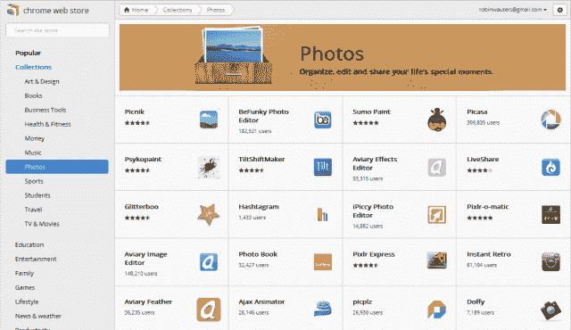

# 谷歌给 Chrome 网上商店刷了一层新漆 TechCrunch

> 原文：<https://web.archive.org/web/http://techcrunch.com/2011/10/25/google-gives-chrome-web-store-a-welcome-new-lick-of-paint/>

# 谷歌给 Chrome 网上商店刷了一层新漆，很受欢迎

看起来谷歌今天早上[为其](https://web.archive.org/web/20230203073445/http://twitter.com/#!/filipmares/status/128715333975539713) [Chrome 网上商店](https://web.archive.org/web/20230203073445/https://chrome.google.com/webstore/category/home)推出了全新的设计，这是一个重大的改进。

更新后的[网络应用市场](https://web.archive.org/web/20230203073445/http://www.google.com/chrome/intl/en/more/webstore.html)，第一个[于 2010 年 12 月发布](https://web.archive.org/web/20230203073445/https://techcrunch.com/2010/12/07/live-from-googles-chrome-event-chrome-os-web-store-and-more/)，都是关于软件的，现在拥有带有吸引人的应用视觉效果的大方块。

鼠标悬停时，用户可以获得更多关于应用程序的信息，以及一个点击安装选项。

同样值得注意的是:菜单现在完全在左侧，即使在滚动时也是固定的，扩展和主题不再作为不同的部分突出显示，而只是列表末尾的导航项目。同样消失的还有对“付费应用”的任何提及。

当你点击一个类别或一个“应用程序集合”时，你会看到一个比以前更直观的流行网络应用程序概述，应用程序详细信息页面也经过了重新设计，包括摘要、截图和视频以推广应用程序，以及可以打开的标签以获得更多关于该软件的详细信息或评论。当然，还有一个必须的+1 按钮。

维基百科有一张截图，显示了[在](https://web.archive.org/web/20230203073445/http://en.wikipedia.org/wiki/File:Chrome_Web_Store_Main_Page.png)之前的样子，如果你想比较的话。

(感谢 Saif AL Essai 的提醒)

http://twitter.com/#!/filipmares/status/128715333975539713