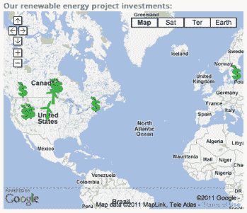

# Google Gives Up On Green Tech Investment Initiative RE <c techcrunch="">> 原文：<https://web.archive.org/web/http://techcrunch.com/2011/11/23/google-gives-up-on-green-tech-investment-initiative-rec/>

在昨天谷歌的服务关闭事件中，包括表现不佳和被弃用的网站，如知识单元、Wave 和 Gears，还有 RE < C 结束的消息。只是那些雄心勃勃的*之一，“我们可以用谷歌的钱拯救世界！”*这类项目让搜索巨头看起来更关心广告收入的流入。在这种情况下，RE < C 专注于降低可再生能源的成本。或者，正如首字母缩略词所示，让“可再生能源”(RE)比煤炭(C)更少(更便宜)。

事实证明，这说起来容易做起来难。

回复<c was="" announced="" back="" in="" by="" google.org="" the="" philanthropy="" arm="" of="" google.="" company="" made="" several="" investments="" companies="" greentech="" space="" including="" brightsource="" energy="" esolar="" and="" geothermal="" drilling="" innovators="" potter="" drilling.="" project="" funding="" helped="" sponsor="" research="" that="" used="" to="" develop="" first="" href="https://web.archive.org/web/20230209124759/http://blog.google.org/2011/10/new-geothermal-map-of-united-states.html">美国地热图</c>

通过 RE

What’s interesting about the RE

When the initiative was announced in 2007, Google [对 Brightsource 进行的 1000 万美元股权投资表示](https://web.archive.org/web/20230209124759/http://www.google.com/intl/en/press/pressrel/20071127_green.html)预计将花费“数千万美元用于可再生能源的研发和相关投资。”这仅仅是开始。谷歌还声称，它预计将投资“数亿美元用于产生正回报的突破性可再生能源项目。”

在增强型地热系统(EGS)技术上投资超过 1000 万美元。然而，在 RE < C 之外，谷歌投资[3880 万美元](https://web.archive.org/web/20230209124759/http://googleblog.blogspot.com/2010/05/not-merely-tilting-at-windmills.html)于 NextEra Energy Resources 开发的风力发电场，并投资了[大西洋风力连接(AWC)主干网](https://web.archive.org/web/20230209124759/http://googleblog.blogspot.com/2010/10/wind-cries-transmission.html)37.5%的股权，该主干网旨在连接大西洋上 6000 兆瓦的海上风力涡轮机。

迄今为止，该公司表示，它在可再生能源领域投资了超过 8 . 5 亿美元，其中只有大约 3000 万美元来自 RE < C。可再生能源项目总共能够产生 1.7 GW 的电力，相当于 350，000 个家庭使用的电力。其他投资包括[太阳能城](https://web.archive.org/web/20230209124759/http://googleblog.blogspot.com/2011/06/helping-homeowners-harness-sun.html)的 2.8 亿美元、[莫哈韦的一个风力发电厂](https://web.archive.org/web/20230209124759/http://googleblog.blogspot.com/2011/05/investing-in-alta-wind-energy-center.html)的 1.57 亿美元、[俄勒冈州谢泼德的平坦风力发电厂](https://web.archive.org/web/20230209124759/http://googleblog.blogspot.com/2011/04/shepherding-wind.html)、[德国一个太阳能设施的约 500 万美元](https://web.archive.org/web/20230209124759/http://googlepolicyeurope.blogspot.com/2011/04/google-to-invest-in-german-solar-power.html)、创建清洁能源金融(CPF)基金的 7500 万美元以及此处列出的其他。

谷歌还向世界上最大的塔项目投入了 1.68 亿美元——bright source 的 [Ivanpah 太阳能发电系统(ISEGS)](https://web.archive.org/web/20230209124759/http://ivanpahsolar.com/) ，该项目定于 2013 年完工。该塔将产生 392 兆瓦的清洁太阳能。

目前还不清楚这种投资水平会在多大程度上随着这个曾经被高度评价的项目的关闭而持续下去:

> 我们希望运用同样的创造力和创新来应对在全球范围内大规模生产可再生电力的挑战，并以比煤炭更低的成本生产这种电力。凭借有才华的技术专家、优秀的合作伙伴和巨额投资，我们希望快速向前推进。我们的目标是生产 10 亿瓦比煤更便宜的可再生能源。我们乐观地认为这可以在几年内完成，而不是几十年。
> 
> 如果我们实现了这一目标，并且大规模的可再生能源部署比煤炭更便宜，世界将有机会通过可再生能源满足大部分电力需求，并大幅减少碳排放。
> 
> 我们希望这对我们来说也是一笔好生意。

~~可悲的是，在投资了 8.5 亿美元之后，谷歌似乎并不认为绿色科技是一项好生意。~~

***更新*** :这篇文章被更新，以澄清 NextEra 和 AWC 是 RE < C 之外的投资。此外，谷歌的一位发言人表示，“我们仍然致力于可再生能源领域，我们计划继续投资，以增加我们超过 8.2 亿美元的能源项目投资。”</c>