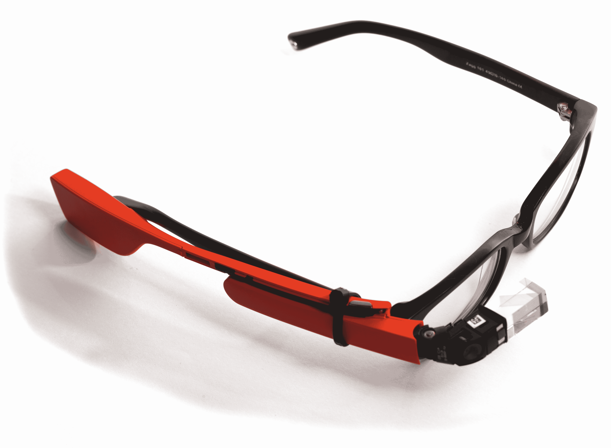
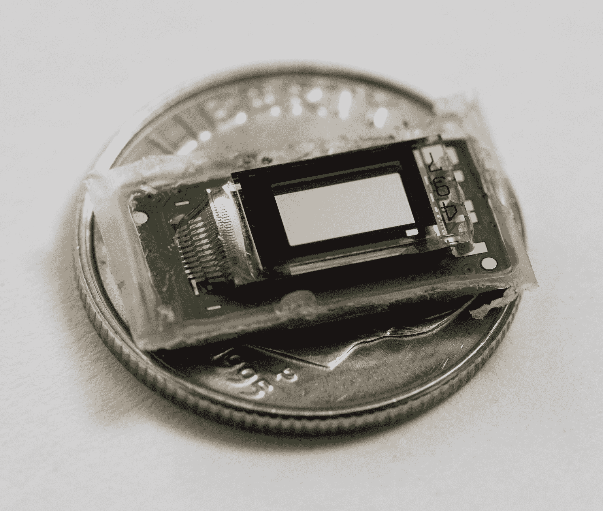

# 谷歌眼镜被拆，显示它可以被黑客攻击成处方眼镜 

> 原文：<https://web.archive.org/web/https://techcrunch.com/2013/06/12/google-glass-gets-a-teardown-revealing-it-can-be-hacked-to-prescription-glasses/>

# 谷歌眼镜被拆，显示它可以被黑客攻击成处方眼镜

谷歌眼镜还没有到消费者手中，但一对勇敢的眼镜探险家没有让这阻止他们把它拆开，看看是什么让它滴答作响。就拍摄构图和图像质量而言，这种拆卸也特别令人满意，所以如果你渴望对谷歌眼镜内部的技术有一个真正好的近距离观察，我强烈建议看看[猫眼的家伙们把](https://web.archive.org/web/20221231063710/http://www.catwig.com/google-glass-teardown/)放在一起(通过[9 到 5 谷歌](https://web.archive.org/web/20221231063710/http://9to5google.com/2013/06/12/google-glass-teardown-its-surprisingly-simple/?utm_source=feedburner&utm_medium=twitter&utm_campaign=Feed%3A+9to5Google+%289to5+Google+-+Beyond+Good+and+Evil%29))。

他们不仅把玻璃拆开，还以一些令人惊讶的方式把它组装起来，就像科学怪人一样，包括把商业碎片附在一副处方眼镜上。他们说，这种黑客技术是有效的，但仅仅是初步意义上的；内置于眼镜中的接近传感器在相对于处方镜片定位时工作不太正确，但看起来没有任何主要障碍来使眼镜兼容。

宝藏中其他有趣的发现包括一个专门的 Synaptics 触摸板控制器，用于处理基于触摸的控制，以及一个只有 570 mAh 容量的电池模块，以及一个表面积小于一毛钱但分辨率为 640×360 的显示器的技术奇迹，每个像素约为苹果 iPhone 5 Retina 显示器的八分之一。

目前还不知道谷歌眼镜的最终发货版本在硬件和构建方面将如何与当前的探索者版本相比较，但这仍然提供了一个非常有趣的视角，来看看谷歌的大型可穿戴技术实验是如何实现其奇迹的。奇怪的是，这种毫不客气的解构实际上让我更想要眼镜，尽管我之前对这个仍然未经证实的硬件有着不温不火的兴趣。