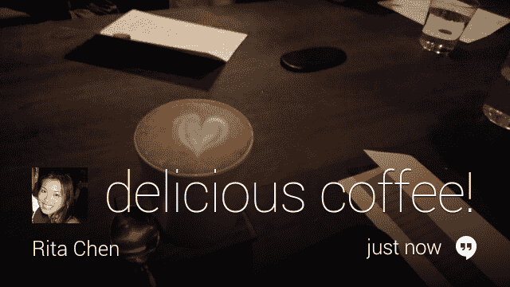

# 谷歌眼镜有“眨眼拍照”模式、锁屏、YouTube 上传和 Hangouts 聊天| TechCrunch

> 原文：<https://web.archive.org/web/http://techcrunch.com/2013/12/17/google-glass-gets-lock-screen-youtube-uploading-hangouts-chat-and-wink-to-shoot-picture-mode/>

# 谷歌眼镜有“眨眼拍照”模式、锁屏、上传 YouTube 和 Hangouts 聊天

谷歌刚刚宣布了对谷歌眼镜的大规模更新，增加了锁屏、Hangouts 聊天、通过谷歌眼镜应用程序直接上传 YouTube 和“眨眼拍照”模式。眨眼拍照模式显然很有趣，因为开发人员不久前在玻璃固件中发现了对它的引用，现在它才刚刚出现。

你只需打开模式，眨眨眼就能拍摄照片。这消除了使用照片按钮或语音命令拍摄图像的需要。当然，这里有一些迫在眉睫的隐私问题——眨眼比把手放在脸上或大声说出来要少得多。

“谷歌眼镜是为了帮助你仰望和体验你周围的世界，而不会被技术所束缚，”帖子上写道。“基于这一理念，我们推出了新的设置，让您只需眨眨眼就能快速轻松地捕捉到您关心的瞬间。无论是在傍晚散步时捕捉令人惊叹的日落，还是拍摄你需要花费的午餐收据，你现在都可以停留在那一刻，眨眨眼就能立即拍照。”

帖子上说照片“只是开始”。它让你想象这样的场景，比如“眨一下出租车的计价器”来支付车费，或者对商店橱窗里的一双鞋眨一下眼来购买一双符合你尺寸的鞋子，然后把它们寄给你。

“你对着一本食谱眨眨眼，说明就出现在你面前——不用手，不混乱，不忙乱。挺酷的吧？”

当然，也许吧。不过，就目前而言，人们在拍摄对象不知情的情况下用眼镜拍照会容易得多。这似乎可能会导致与那些反对谷歌头戴式电脑的人产生更多摩擦。出于保护顾客隐私的考虑，一些餐馆已经禁止使用这种设备。

一个新的锁屏模式现在会把你的耳机夹住，直到你按你设置的模式通过点击和滑动解锁。你现在也可以直接从你设备上的玻璃器皿应用上传到 YouTube，这种体验以前是由黑客入侵该平台的开发者实现的。Google Music All Access 订阅用户现在也可以通过此次更新访问他们的音乐和播放列表。

谷歌还指出，它过早地在 App Store 上放弃了 iOS 版本的 MyGlass，但表示将在本周晚些时候再次上线。该应用程序在今天早些时候消失之前，曾短暂出现在商店中。