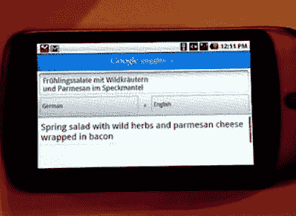

# Google Goggles 会在翻译中迷失吗？

> 原文：<https://web.archive.org/web/http://techcrunch.com/2010/02/16/google-goggles-getting-ocr-translations/>

# Google Goggles 会在翻译中迷失吗？

今天在西班牙巴塞罗那举行的移动网络大会上，谷歌首席执行官埃里克·施密特在他的主题演讲中展示了一个对任何试图找出不同语言菜单或外国街道标志的人来说都是至关重要的工具。[谷歌眼镜](https://web.archive.org/web/20230202220707/http://www.google.com/mobile/goggles/)，基于图片而不是键入的关键词创建搜索查询[，将很快开始能够使用](https://web.archive.org/web/20230202220707/https://techcrunch.com/2009/12/07/google-goggles/)[谷歌翻译](https://web.archive.org/web/20230202220707/http://translate.google.com/)从外语进行翻译。它将使用光学字符识别首先将字母的图像转换成它可以理解的单词，然后通过谷歌翻译。

施密特展示了一张 Android 手机翻译德国“野生香草和帕玛森奶酪包裹培根的春季沙拉”的图片。(MobileCrunch 编辑格雷格·库姆帕拉克(Greg Kumparak)在左侧拍摄了照片)。当然，谷歌翻译经常得到翻译[错误](https://web.archive.org/web/20230202220707/https://techcrunch.com/2009/02/18/google-needs-french-lessons-translates-vimeo-to-youtube/)，以[幽默](https://web.archive.org/web/20230202220707/https://techcrunch.com/2009/08/07/translation-party-tapping-into-google-translates-untold-creative-genius/)的效果。但是当你不会说这种语言时，即使是部分翻译也比什么都没有好。谷歌翻译支持 50 多种语言。

施密特还透露，现在每天售出 60，000 部安卓手机。