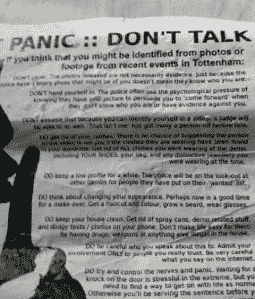

# 谷歌团队成员将使用面部识别识别伦敦骚乱者 

> 原文：<https://web.archive.org/web/https://techcrunch.com/2011/08/09/google-group-members-to-use-facial-recognition-to-identify-london-rioter/>

# 谷歌小组成员将使用面部识别识别伦敦骚乱者

在周末震惊英国首都的骚乱发生后，一个名为“[伦敦骚乱面部识别](https://web.archive.org/web/20230216162924/http://groups.google.com/group/london-riots-facial-recognition)”的新谷歌小组出现在网上。该组织的目标是使用面部识别技术来识别出现在网上照片中的抢劫者。

例如，在标题为“[道德问题](https://web.archive.org/web/20230216162924/http://groups.google.com/group/london-riots-facial-recognition/browse_thread/thread/a396b460d47544db)”和“[保持合法](https://web.archive.org/web/20230216162924/http://groups.google.com/group/london-riots-facial-recognition/browse_thread/thread/204fec2cb218f567)”的帖子中，该组织似乎在深思熟虑地考虑自己的行动。他们还声明“我们只使用合法来源的图片，这很重要。”

然而，这项事业也有一个主要的“令人毛骨悚然”的因素。一群人会在网上组队使用(误用？)面部识别技术以这种方式，尤其是在专业执法渠道之外，似乎像是对义务警员式司法的现代演绎，愤怒村民的火炬变成了 API 和算法。

在今天早上刚刚开始的一个更新的帖子中，一位评论者提供了他们使用 [Face 构建工具的帮助。API](https://web.archive.org/web/20230216162924/http://developers.face.com/) ，可以帮助识别脸书、Flickr 和 Twitter 上发布的照片中的人。甚至有人谈到将脸书图形 API 和 Twitter API 与 Face.com API 结合使用，以帮助更好地识别罪犯。

虽然很明显，我们不反对将罪犯绳之以法，但仍可能存在一些与此类在线行为相关的担忧。正如《黑客新闻》上所讨论的，这种方法可能会牵连到那些没有参与，而是旁观者，或者只是想回家的人。无论他们在这里的行为是否合法，无论他们是否涉及公开照片，问题是——我们想以这种方式众包正义吗？

*图片来源:top:[daily mail](https://web.archive.org/web/20230216162924/http://www.dailymail.co.uk/news/article-2023254/Tottenham-riot-Mark-Duggan-shooting-sparked-police-beating-girl.html)*