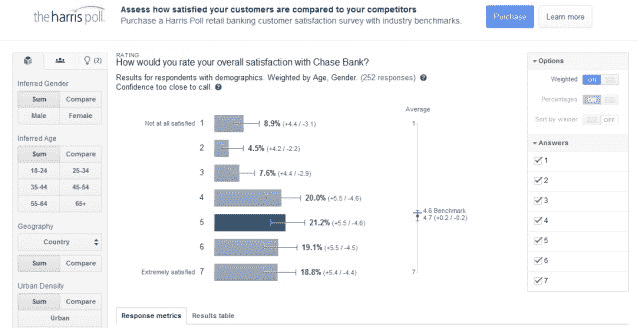

# 谷歌与哈里斯互动合作推出新的自助式消费者研究工具 TechCrunch

> 原文：<https://web.archive.org/web/https://techcrunch.com/2012/09/18/google-harris-interactive-market-research/>

# 谷歌与哈里斯互动合作推出新的自助式消费者研究工具

市场研究公司 Harris Interactive 今天宣布，它正在与谷歌最近推出的 [谷歌消费者调查](https://web.archive.org/web/20221005221121/http://www.google.com/insights/consumersurveys/home)合作，“开发并向市场推出一种新产品，允许企业，无论大小，以传统市场研究的一小部分成本将自己与行业基准进行比较。”利用谷歌的消费者调查平台，哈里斯互动现在将收集和分发行业基准。企业将能够开展自己的调查(收费)，并与竞争对手进行比较。

## 通过调查墙进行市场研究

谷歌消费者调查旨在让企业更容易进行消费者市场调查。有趣的是，用户实际上必须回答你的问题，因为谷歌将其调查定位为传统报纸付费墙的替代品。用户不必付费，只需回答几个问题就能找到他们感兴趣的内容。营销人员可以利用这些“[调查墙](https://web.archive.org/web/20221005221121/http://www.guardian.co.uk/technology/2012/sep/10/monday-note-google-market-research)”来问[基本的多项选择题](https://web.archive.org/web/20221005221121/https://www.google.com/insights/consumersurveys/view?survey=c5x4eptj5iyxw)或者进行更多的[复杂研究](https://web.archive.org/web/20221005221121/https://www.google.com/insights/consumersurveys/view?survey=c5x4eptj5iyxw)；谷歌对普通美国人的每条回复收费 0.10 美元，对定制用户的每条回复收费 0.50 美元(其中一部分将转给网站所有者)。

哈里斯互动首席执行官兼总裁阿尔·安格里萨尼在今天的一份例行声明中表示:“我们很高兴能够参与一项有可能彻底改变市场研究方式的风险投资。”。“这是一个独特的机会，将谷歌创新的消费者调查产品与哈里斯互动在向全球商界提供可信见解方面的专业知识结合起来。”

这次合作的第一个结果是研究人们对他们银行的看法。用户可以使用谷歌调查的交互式用户界面(我们的 Greg Ferenstein 发现[非常可爱](https://web.archive.org/web/20221005221121/https://beta.techcrunch.com/2012/09/07/dear-google_surveys-the-statistics-addict-in-me-wants-to-hug-you/))来[更深入地研究这些结果](https://web.archive.org/web/20221005221121/http://www.google.com/insights/consumersurveys/view?survey=e47k75fcletdi&question=2)，现在较小的银行将自己与较大的竞争对手进行比较。

