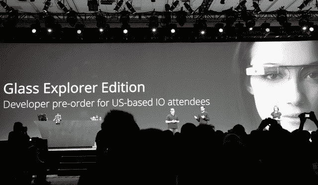

# 谷歌表示，所有 2000 名谷歌眼镜探索者都被邀请去拿他们的设备——

> 原文：<https://web.archive.org/web/https://techcrunch.com/2013/05/16/google-has-now-invited-all-2000-people-who-signed-up-at-last-years-io-to-pick-up-glass/>

# 谷歌表示，所有 2000 名谷歌眼镜探索者都被邀请去拿他们的设备

今天，谷歌 X 和谷歌眼镜团队的李家鼎宣布，截至上周，在去年的 I/O 大会上报名参加谷歌眼镜探索者计划的所有 2000 名开发人员现已被邀请到谷歌位于山景城、纽约市或洛杉矶的办公室领取他们的设备。

当然，不是每个人都必须支付 1500 美元来获得它们，如果他们不想的话，但可以肯定地说，大多数开发商都会拿起它们并放下现金。

Lee 还指出，仍需支付费用的 8,000 # ifihadglass“获奖者”将很快开始领取奖金。让那些将要开发应用程序的人拥有这款设备的重要性，这是我们了解这款设备能力的唯一途径，这并不是一件容易的事情。你不可能真的让一个设备静静地坐在你的脸上，因此需要一个去年宣布的探索者计划。李说:“这不是我们在某个秘密实验室里能研究出来的东西；它必须出现在现实世界中。”

李还指出，谷歌眼镜将每月收到软件更新，包括漏洞修复和新功能，这意味着我们可以预计另一个版本将于 6 月初发布，类似于 5 月 8 日的版本。最近一次更新并没有彻底改变用户体验；引入“长按”搜索很方便。

当我们在 I/O 大会上走动时，经常会发现有人在他们的位置前停下来拍照或浏览时间线。至于这是不是一款会让消费者喜欢的设备，还有很多问题需要回答，但在早期观察它的演变是很有趣的。

有趣的是，谷歌的高管们，像拉里·佩奇和维克·冈多特拉，并没有展示他们的眼镜，特别是在昨天的主题演讲台上。有些人觉得这是一种淡化产品炒作的方式，让开发者接管谷歌眼镜的“代言人”角色。

【T2