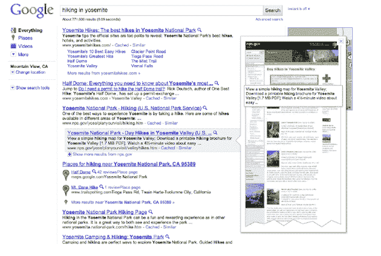
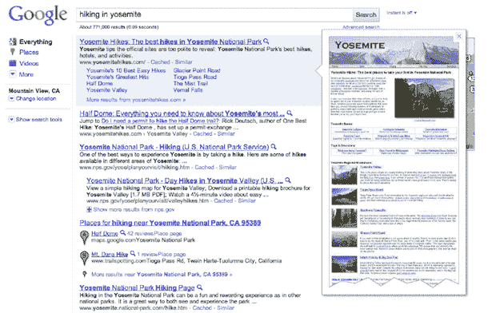

# 谷歌即时预览:做好准备，对谷歌搜索的满意度可能会提高 5% 

> 原文：<https://web.archive.org/web/https://techcrunch.com/2010/11/09/google-instant-previews/>

# 谷歌即时预览:做好准备，对谷歌搜索的满意度可能会提高 5%

我想不起有什么比谷歌即时预览更让我们兴奋的了。甚至在一个月前我们报道了 T2 出现在野外之后，消息还是源源不断。就在昨天，我们又收到了两条:“谷歌新功能！！!"我们感谢这些提示，今天我很高兴地说，你可以停止发送这个特定的提示了。因为谷歌正式推出该功能。

很明显，很多人已经看到，谷歌即时预览可以让你直接从谷歌搜索结果页面看到网站上的内容。你所要做的就是点击结果旁边的小放大镜图标，链接右边会出现一个覆盖图，显示页面上的内容。

谷歌杰出的工程师 Ben Gomes 告诉我们:“*这是即时*故事的下一步。他指出，谷歌已经从标准的文本输入，到自动完成，再到即时，现在我们有了即时预览。戈麦斯说，这一切都是为了“*拓展技术的可能性界限*”。

说实话，这个新功能更有趣的方面不是功能本身——其他人以前也做过类似的事情——而是它背后的技术。具体来说，戈麦斯说，谷歌能够在不到 1/10 秒的时间内调出这些预览。它们会随着内容的变化而动态更新。谷歌会在他们的索引中为每一个链接结果添加链接。

这不仅仅是关于预览，也是关于找出被预览页面上的单词。如果你正在搜索一个特定的短语，谷歌可以找到它，并在这些预览中突出显示。这样你可以得到更多的上下文信息，以确保这是你要找的页面。

当我问戈麦斯，他是否认为一些内容出版商可能会对这种点击前数据的概念感到恼火，他说他不这么认为。相反，他认为即时预览几乎是内容网站的广告。预览给人一种感觉，吸引用户。

同样，众所周知，谷歌已经测试这个功能有一段时间了。他们在内部对所有谷歌员工都这样做了，在外部对焦点小组和一小部分公众也这样做了。戈麦斯说，反应非常积极，用户对他们最终点击的结果感到更加满意。

要多满足？百分之五。是的，谷歌测量过。

谷歌即时预览现在已经上线，并将成为未来谷歌搜索体验的标准部分。

