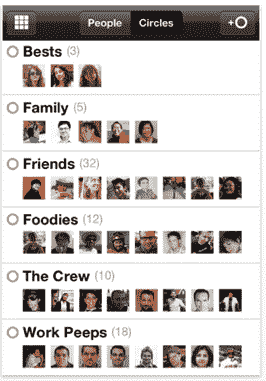

# Google+ iPhone 应用程序现已在应用商店上线(截图)

> 原文：<https://web.archive.org/web/https://techcrunch.com/2011/07/19/google-iphone-app-now-live-in-the-app-store/>

# Google+ iPhone 应用程序现已在应用商店上线(截图)

Google+的 iPhone 应用程序现已在 App Store 上线，你可以在这里下载免费应用程序[。](https://web.archive.org/web/20230205022249/http://itunes.apple.com/us/app/google/id447119634?ls=1&mt=8)

从谷歌对该应用的描述来看， *Google+手机版让与合适的人分享合适的东西变得简单多了。Huddle 让您可以向您最关心的人发送超快的消息。无论您身在何处，stream 都可以让您随时了解您的朋友在分享什么以及他们在哪里签到。*

与网络产品类似，iPhone 版 Google+包括圈子(你的联系人更新流)和 Huddle(你圈子里的群发消息)。

虽然[谷歌+安卓应用](https://web.archive.org/web/20230205022249/https://market.android.com/details?id=com.google.android.apps.plus&feature=search_result)在第一天就准备好了，但谷歌+ iPhone 应用仍在苹果的审查中。到目前为止，iPhone 用户不得不在 Safari 中访问 Google+的移动网络版本[,其功能远不如 Android 应用丰富。](https://web.archive.org/web/20230205022249/https://techcrunch.com/2011/06/28/google-plus-iphone-web-app/)

看起来 iPhone 应用程序和 Android 应用程序在功能上非常相似，除了 Android 应用程序中包含的即时上传功能。即时上传会自动将视频和照片上传到云中的 Google+相册。此外，该应用程序还不支持 iOS 5。

正如拉里·佩奇[上周告诉我们的那样，](https://web.archive.org/web/20230205022249/https://techcrunch.com/2011/07/14/larry-page-on-google-over-10-million-users-1-billion-items-shared/) Google+现在已经有超过 1000 万用户创建了个人资料(两周后)，这些用户每天分享和接收 10 亿条信息。

**更新:**很多读者都评论说 app 在冻。谷歌在这里回应了其中一些担忧。

