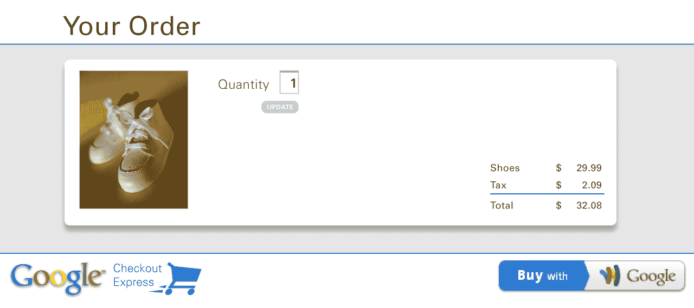

# 谷歌正在打造一个同一天亚马逊的主要竞争对手“谷歌购物快递”

> 原文：<https://web.archive.org/web/https://techcrunch.com/2013/03/04/google-is-building-a-same-day-amazon-prime-competitor-google-shopping-express/>

# 谷歌正在打造亚马逊的主要竞争对手“谷歌购物快递”

 谷歌正在秘密准备推出一款[亚马逊 Prime](https://web.archive.org/web/20221208144009/http://www.amazon.com/gp/help/customer/display.html/?nodeId=200444160) 的竞争产品，名为“谷歌购物快递”据一位消息人士称，这项服务将比亚马逊 Prime 便宜 10 美元或 15 美元，每年 69 美元或 64 美元，并提供从塔吉特、沃尔玛、沃尔格林和西夫韦等实体店当天送达的服务(尽管我们的消息人士没有提到具体细节)。

如果该产品上市，它将成为亚马逊 Prime、易贝 Now、Postmates 的[、](https://web.archive.org/web/20221208144009/http://www.postmates.com/getitnow)以及像 [Instacart 这样的小型初创公司的竞争对手。](https://web.archive.org/web/20221208144009/http://www.instacart.com/)

我们听说该项目由谷歌电子商务产品经理汤姆·法洛斯(Tom Fallows)负责，旨在专注于谷歌的电子商务计划。谷歌钱包和谷歌购物需要一个焦点，作为大牌零售商的[【商店货架】](https://web.archive.org/web/20221208144009/http://gigaom.com/2013/02/24/googles-plan-to-eat-amazons-lunch-and-dominate-retailing/)可能就是这样。一段时间以来，谷歌(T4)一直在想方设法利用其在这一领域的优势——事实上，这可以说是人们想找产品时首先访问的地方之一。

如果谷歌购物快递服务公开亮相，我们没有理由认为它不会，这将意味着该公司可以利用其最近收购的 [BufferBox](https://web.archive.org/web/20221208144009/https://beta.techcrunch.com/2012/11/30/why-did-google-buy-bufferbox-because-the-entire-mail-and-package-delivery-system-is-broken/) 和 [Channel Intelligence](https://web.archive.org/web/20221208144009/https://beta.techcrunch.com/2013/02/06/google-acquires-channel-intelligence-to-boost-product-recommendations-and-e-commer-with-users/) 来主导线上到线下零售市场。谷歌可能会使用其 BufferBox 交付储物柜来方便运输——就像亚马逊[在西雅图、纽约和英国测试的](https://web.archive.org/web/20221208144009/http://www.slate.com/articles/business/small_business/2012/07/amazon_same_day_delivery_how_the_e_commerce_giant_will_destroy_local_retail_.html)一样。它可以利用 Channel Intelligence 的数据管理平台来协调销售和交付。

我们相信谷歌的员工可能已经开始使用这项服务了，但是我们对合作关系是如何处理的以及订阅是如何运作的知之甚少。如果你知道的话，你知道在哪里可以找到我们。