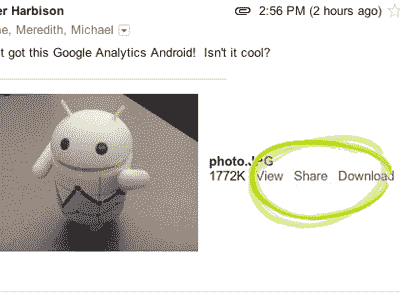

# Google+即将登陆 Gmail & Contacts，包括自动更新的地址簿

> 原文：<https://web.archive.org/web/https://techcrunch.com/2011/12/08/google-is-coming-to-gmail-contacts-along-with-an-automatically-updated-address-book/>

一直在回避 Google+？太糟糕了！谷歌[今天宣布](https://web.archive.org/web/20230304092035/http://gmailblog.blogspot.com/2011/12/gmail-and-contacts-get-better-with.html)Google+正在深度整合到 Gmail 和谷歌联系人中。通过 Gmail 屏幕侧面的一个小工具，你可以看到你正在查看的那个人的最新 Google+帖子，并且你可以将他们添加到你的 Google+圈子中。你还可以使用你创建的 Google+圈子对你的电子邮件和联系人列表进行分类。

但最精彩的部分是什么？对于您在 Google+上维护 Google 个人资料页面的任何联系人，Google 将自动使用他们最近的联系信息更新您的地址簿。

哦嘿，看那个。Google+开始变得有趣了。

我并不是说 Google+以前不有趣——任何以谷歌的规模挑战脸书的人都值得一看。此外，你知道，Google+有一个很棒的 Hangouts 功能。但是这种由 Google+提供的自动更新的地址簿可能会成为整个系统的关键卖点。

很少有公司以真正的热情致力于攻击社交通讯录，而那些试图搞清楚这件事的公司，例如 [Gist](https://web.archive.org/web/20230304092035/http://gist.com/) ，让[收购了](https://web.archive.org/web/20230304092035/https://techcrunch.com/2011/02/14/rim-acquires-professional-contact-manager-gist/)。有几个在线和移动应用程序和付费服务，如 Plaxo，以及那些烦人的电子邮件，恳求你更新联系信息*请，哦，请*。

没有了吗？

 凭借自动更新的通讯录，谷歌正利用其关键优势之一——超过 2 亿的 Gmail 用户——在脸书苦苦挣扎的领域发起进攻。由于脸书多年来在隐私问题上的拙劣表现，许多主流用户对在脸书输入他们的联系信息(如家庭住址和电话号码)持谨慎态度。

然而，谷歌，尤其是 Gmail 和 Contacts，被视为实用工具。这里可能也有点令人毛骨悚然，但是自动更新地址簿的好处将超过 Gmail 的许多重度用户的风险。

虽然这可能是今天宣布的变化中最大的新闻，但除了 Gmail/Circles 集成和新的社交分享和过滤机制之外，还有几个新功能即将推出。例如，谷歌还推出了一种让朋友在 Google+上分享电子邮件照片的方式，即在图片附件旁边的“查看”和“下载”按钮旁边增加一个“分享”按钮。

一些人，特别是那些传统上使用电子邮件分享照片的人，这些照片不是*而不是*应该发布到网上的，可能对这一特殊的变化不太兴奋。

你可以在谷歌的[博客文章](https://web.archive.org/web/20230304092035/http://gmailblog.blogspot.com/2011/12/gmail-and-contacts-get-better-with.html)上了解谷歌联系人和 Gmail 的所有新变化。这些更新将在未来几天内向 Gmail 用户推出。谷歌应用程序的用户将会跟进。

