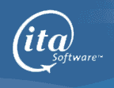

# 谷歌支付 7 亿美元现金收购航班信息提供商 ITA 

> 原文：<https://web.archive.org/web/https://techcrunch.com/2010/07/01/google-ita-700-million/>

# 谷歌支付 7 亿美元现金收购航班信息提供商 ITA

谷歌现在从事航班信息业务。搜索巨头[刚刚宣布](https://web.archive.org/web/20230305161541/http://investor.google.com/releases/2010/0701.html)将以 7 亿美元现金收购 [ITA 软件](https://web.archive.org/web/20230305161541/http://www.itasoftware.com/)，这是一家为航空公司、旅行社和在线预订系统提供航班信息的重要供应商。早在 2006 年，ITA 就从红杉、Battery Ventures 和 General Catalyst 那里筹集了 1 亿美元的 A 轮融资。

旅游是搜索和在线商务的一个巨大部分。收购 ITA 标志着谷歌打算大力发展其旅游搜索业务。包括微软、Kayak、Expedia 和 Travelport [在内的竞争对手组成的财团去年春天试图对抗谷歌的报价](https://web.archive.org/web/20230305161541/http://www.boston.com/business/technology/articles/2010/06/30/travel_sites_could_ally_to_keep_ita_independent/)，因为他们都依赖 ITA 的数据，并希望该公司不受谷歌控制。据报道，ITA 坚持 10 亿美元，但谷歌以其最初提出的 7 亿美元的价格获得了这笔交易。

如果你今天在谷歌上搜索航班，你得到的只是大型在线旅游网站的链接。另一方面，Bing 提供更丰富的旅行体验，包括不同旅行引擎的同一航班的比较价格，以及 Farecast 的预测图表(2008 年被微软以 1 . 15 亿美元收购)。Bing 也从 ITA 获得了很多航班和票价数据。

谷歌将[使用 ITA 的数据创建](https://web.archive.org/web/20230305161541/http://googleblog.blogspot.com/2010/07/taking-off-with-ita.html)“新的航班搜索工具”，并承诺履行其与合作伙伴的现有协议。但你能想象必应向谷歌支付飞行数据吗？当那份合同需要续约时，谈判将会变得一点也不简单。