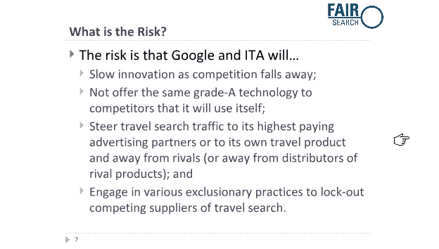

# 谷歌提议的 ITA 交易让在线旅游业叫苦不迭，“不公平！”

> 原文：<https://web.archive.org/web/https://techcrunch.com/2010/10/26/google-ita-travel-no-fair/>

# 谷歌提议的 ITA 交易让在线旅游业叫苦不迭，“不公平！”

谷歌提议以 7 亿美元收购飞行数据巨头 ITA Software 的，遭遇了在线旅游行业的严重抵制。包括 Expedia、Kayak、Travelocity 和猫途鹰在内的一些在线旅游公司正在游说司法部通过一个名为 [FairSearch](https://web.archive.org/web/20230305161633/http://www.fairsearch.org/) 的组织[以反垄断为由阻止](https://web.archive.org/web/20230305161633/http://online.wsj.com/article/SB10001424052702304248704575574710753536950.html)的交易。这些公司中的一些也是 ITA 软件竞标失败的幕后黑手。微软也单独反对这项交易。

ITA 向许多旅游网站、航空公司网站和微软的 Bing 搜索引擎提供航班数据、时刻表、票价和可用性。公平搜索联盟认为，允许“谷歌可以利用 ITA 试图以提高消费者价格和限制创新的方式边缘化竞争对手。”他们担心谷歌会利用其搜索优势将流量从他们自己的网站上转移出去，转而支持谷歌自己的航班搜索。

这些担心并非完全没有根据。这里事关重大。在线旅游是一项巨大的业务。据估计，它的电子商务销售额为 800 亿美元，占去年所有电子商务的 38%(迄今为止最大的一部分)。它还贡献了约 6%的在线广告(以及约 8%至 10%的谷歌收入)。大约三分之二的旅行计划是从搜索引擎开始的，FairSearch 声称超过 30%的旅行搜索是从谷歌开始的。

让这项交易通过司法部将是对谷歌的一个巨大考验。就其本身而言，谷歌[回应](https://web.archive.org/web/20230305161633/http://googlepublicpolicy.blogspot.com/2010/10/giving-users-best-answer-and-competing.html)它将遵守 ITA 的所有现有合同，不会出售机票，并计划继续向旅游和航空网站发送流量。谷歌想要 ITA 的原因是因为航班搜索坏了，需要修复。

但是为了解决航班搜索的问题，谷歌很可能会让用户在谷歌上停留更长时间，然后再把他们送到旅游网站。就像今天 Bing 的 ITA 支持的旅游部分是一个功能齐全的旅游搜索引擎，直到最后一次点击购买，谷歌可能会朝着类似的方向前进。可以理解的是，旅游网站不喜欢谷歌获得更多业务控制权的前景。

正如我之前所写的，ITA 交易代表着谷歌战略的巨大转变，谷歌将转向更垂直的搜索，并可能从每次点击费用(CPC)转向每次行动费用(CPA)广告。如果谷歌开始根据每张购买的机票而不是每次点击向旅游网站收取 CPA 奖金，会怎么样？在这种情况下，谷歌会赚更多的钱，而旅游网站会赚得更少——但前提是谷歌有足够好的数据来知道哪些航班可以显示哪些旅行者。这就是谷歌需要拥有 ITA 及其所有数据的原因。

这是否会引发反垄断担忧？也许吧。但这都是假设的伤害。只有一件事是肯定的，如果谷歌通过 DOJ 获得这笔交易，你可以预计会有更多的人追求其他在线行业垂直市场，这反过来将改变谷歌的搜索体验，取决于你所做的搜索类型。

