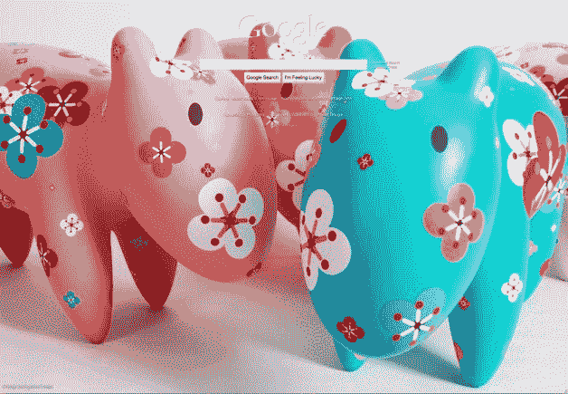
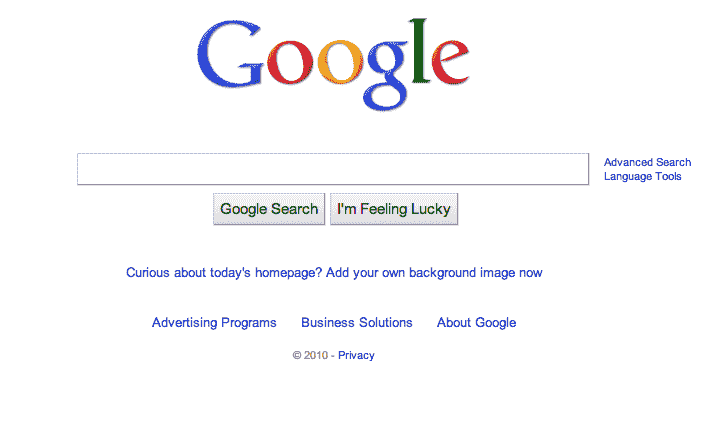

# 谷歌提前取消主页背景图片实验 

> 原文：<https://web.archive.org/web/https://techcrunch.com/2010/06/10/google-kills-its-homepage-background-image-experiment-early/>

# 谷歌早早扼杀其主页背景图片实验

昨晚，谷歌决定暂时放弃其著名的简朴主页背后的原则，取而代之的是一些稍微不同的东西:[一个背景图片](https://web.archive.org/web/20221006115845/https://beta.techcrunch.com/2010/06/09/google-adds-a-background-image-to-its-homepage-by-default-at-least-for-24-hours/)，自从它推出以来，它一直是竞争对手搜索引擎必应上的一个设计元素。不出所料，当用户干净、光秃秃的主页突然出现花花绿绿的河马和其他彩色照片时，他们会发疯。无数推文抱怨这些图片，我们昨晚的故事有超过 200 条评论。“移除谷歌背景”目前是谷歌第五大热门话题。

现在，谷歌显然已经决定给用户强加一个背景图像毕竟不是一个好主意，根据谷歌负责搜索产品和用户体验的副总裁 Marrisa Mayer 的一条[推文](https://web.archive.org/web/20221006115845/http://twitter.com/marissamayer/status/15865817001)，他们已经提前大约 10 个小时关闭了他们的实验。访问谷歌主页的用户现在可以看到正常的设计，还有一个链接，上面写着“对今天的主页感到好奇吗？现在添加您自己的背景图像”。

根据昨晚在其官方博客上发布的一篇帖子，谷歌计划在 24 小时内轮换其主页上的一些专业照片，并计划在该时间段结束后恢复正常。该试验显然是为了推广谷歌[上周发布的](https://web.archive.org/web/20221006115845/https://beta.techcrunch.com/2010/06/02/google-bing-like-backgrounds/)新功能，该功能允许用户添加自己的背景图片，这里的不同之处在于*所有*用户都暂时获得了一张背景图片，不管他们是否想要。

**更新:**谷歌已经更新了它的博客文章，解释他们为什么缩短这篇文章。他们将其归咎于一个未能显示解释性链接的“错误”:

> 我们计划在它旁边运行一个展示的解释——以我们主页上的链接的形式。由于一个错误，大多数用户看不到说明性链接。结果很多人以为我们永久改了主页，所以决定提前停止今天的系列。我们感谢您的反馈和耐心，因为我们的实验和迭代

