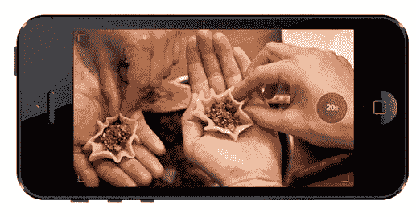
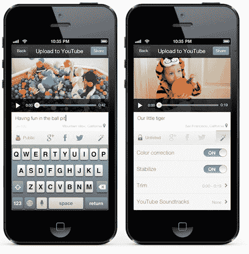

# 谷歌推出 iPhone 和 iPod Touch 专用 YouTube 视频摄像头应用 

> 原文：<https://web.archive.org/web/https://techcrunch.com/2012/12/17/google-launches-dedicated-youtube-video-camera-app-for-iphone-and-ipad-touch/>

# 谷歌推出 iPhone 和 iPod Touch 专用的 YouTube 视频摄像头应用程序

谷歌有一个有趣的举动，它在最近几个月明显加快了它的移动游戏:你现在可以[下载一个专门的 YouTube 相机应用](https://web.archive.org/web/20221108205508/http://youtube-global.blogspot.com/2012/12/film-and-share-videos-instantly-with.html)—[YouTube 捕获](https://web.archive.org/web/20221108205508/https://itunes.apple.com/us/app/youtube-capture/id576941441)——用于 iPhone 和 iPod touch。该应用程序允许你录制视频剪辑，在你完成拍摄后，你可以写标题，选择你想分享到的网络，并发布。

谷歌写道，这款应用的一个很好的特点是，即使你最小化了它，它也会继续在后台上传你的视频。您还可以通过将视频设置为常用的 YouTube 隐私设置(私人、未列出和公共)来控制谁可以查看您的视频。当然，这款应用还利用了常见的 YouTube 增强功能，如颜色校正和稳定，它可以让你“修剪长度并添加 YouTube 上的免费背景音乐。”

谷歌表示，所有这些功能也适用于你设备上现有的视频，你可以随时撤销它们(但只能通过访问 YouTube.com)。

顺便说一句，有趣的是，这款应用不仅仅让你上传视频到 YouTube，它还支持同时上传到 Google+、脸书和 Twitter。

【YouTube http://www.youtube.com/watch?v=l0sOzdXce6o？feature = player _ 嵌入式]