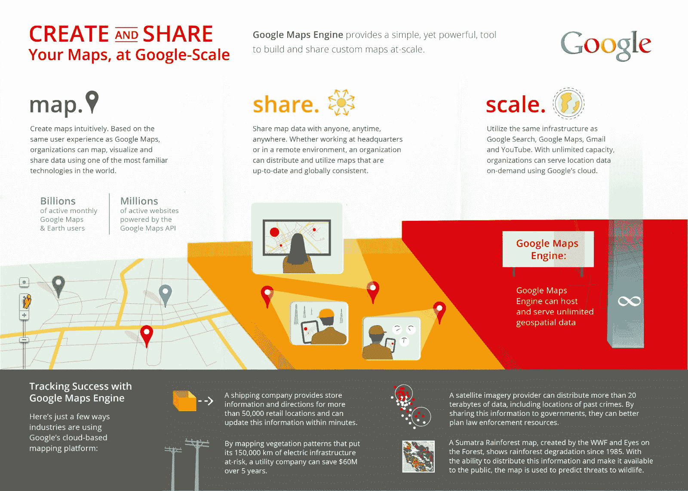

# 谷歌发布地图引擎 API，让企业开发者更轻松地创建、分享和发布定制地图

> 原文：<https://web.archive.org/web/https://techcrunch.com/2013/06/05/google-launches-maps-engine-api-to-allow-enterprise-developers-to-more-easily-create-share-and-publish-custom-maps/>

# 谷歌推出地图引擎 API，让企业开发者更轻松地创建、共享和发布定制地图

谷歌的地图引擎(Maps Engine)是一项面向企业的服务，面向需要根据自定义数据创建自己地图的开发者，于两年前推出，并于去年开始商用。今天，谷歌通过[发布地图引擎 API](https://web.archive.org/web/20230327075550/http://googleenterprise.blogspot.com/2013/06/google-maps-engine-changing-way.html?utm_source=twitterfeed&utm_medium=twitter)为平台增加了更多功能，允许开发者获取他们的定制数据，将其导入地图引擎，然后在他们自己的应用程序中使用。谷歌告诉我，这里的想法是让组织使用谷歌的快速地图云基础设施，将他们的数据放在谷歌地图上，并与他们的员工和客户分享。

你可能会认为谷歌已经有了地图 API，但正如谷歌地图引擎 API 产品经理迪伦·洛里梅告诉我的那样，常规的地图 API 主要专注于让开发者访问谷歌自己的地图内容。地图引擎 API 旨在处理开发人员自己的数据。顺便说一下，整个系统运行在谷歌的分布式全球数据库 [Spanner](https://web.archive.org/web/20230327075550/http://www.wired.com/wiredenterprise/2012/09/google-spanner/) 上。

以前被认为是“实验性”的 API，允许企业开发者通过编程轻松地上传、读取和修改他们的数据。洛里梅指出，由于这种新的 API，开发者现在可以创建符合他们品牌的地图和定制应用程序，并向他们指定的任何开发者公开他们的数据。

[例如，联邦快递](https://web.archive.org/web/20230327075550/http://fedex.com/)已经[测试 API](https://web.archive.org/web/20230327075550/http://googleenterprise.blogspot.com/2013/06/fedexcom-re-imagined-with-google-maps.html) 有一段时间了，其[商店定位器](https://web.archive.org/web/20230327075550/http://www.fedex.com/locate/index.html?locale=en_US#start)的一部分今天已经由它驱动。正如联邦快递的 IT 经理 Pat Doyle 告诉我的那样，该公司自 1 月份决定完全重新设计其系统以使用谷歌的服务后，就一直使用地图引擎来支持其商店定位器。

该公司与谷歌在这方面密切合作，其一些想法流入了地图引擎 API，例如，包括一种更简单的方法来对特定位置的结果进行服务器端排序。使用该 API，联邦快递目前每 15 分钟更新其超过 50，000 个零售接触点的商店时间，包括其投递箱和商店(每个商店目前有大约 150 个数据点)，因此如果停电或自然灾害关闭了一家商店，这将在几分钟内反映在网站上。

正如 Doyle 所指出的，该系统到目前为止是 100%可靠的，该公司的分析表明，现在更多的用户在使用商店定位器时找到了他们想要的东西。在这个视频中，你还可以看到更多关于联邦快递如何做这件事的信息。

该 API 目前仅支持地图引擎功能的一部分[有限部分](https://web.archive.org/web/20230327075550/https://developers.google.com/maps-engine/documentation/reference/v1/)，其中还包括基本的空间查询和处理矢量数据，但该团队计划在不久的将来对该 API 进行大量扩展。洛里梅在我与他交谈时还强调，谷歌一直有兴趣将类似这样的功能引入更大的开发者社区——也就是说，那些没有昂贵的企业地图引擎账户的开发者。Google 现在对此没有什么要宣布的，但是可以肯定的是，我们将来会听到更多关于这个 API 的消息。

