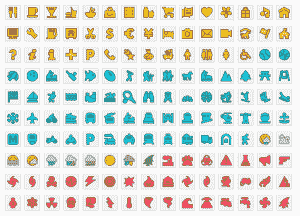
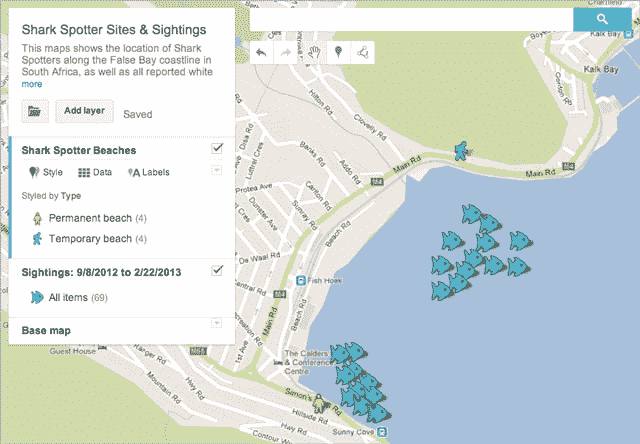
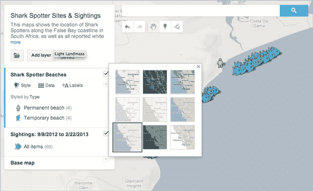

# 谷歌推出地图引擎 Lite，轻松创建高级定制地图

> 原文：<https://web.archive.org/web/https://techcrunch.com/2013/03/27/google-launches-maps-engine-lite-makes-it-easy-to-create-advanced-custom-maps/>

# 谷歌推出地图引擎 Lite，轻松创建高级定制地图

多年来，谷歌已经向希望可视化其定制地理空间数据的企业提供了谷歌地图引擎。从今天开始，任何人都可以使用这一功能的子集，这要感谢[推出](https://web.archive.org/web/20230327064918/http://google-latlong.blogspot.com/2013/03/create-collaborate-and-share-advanced.html)[谷歌地图引擎精简版](https://web.archive.org/web/20230327064918/http://mapsengine.google.com/map)(测试版)。谷歌表示，这个新工具将允许任何地图爱好者“使用这个强大、易用的工具创建和共享强大的定制地图。”

Maps Engine Lite 允许用户[上传带有位置的小电子表格](https://web.archive.org/web/20230327064918/http://www.google.com/earth/outreach/tutorials/mapseng_lite.html)，并在地图上可视化它们。该公司强调，他们还可以比较多达三个不同的数据集，用于非商业目的。

 这些自定义地图可以有多个图层，没有电子表格可以上传的用户也可以手动画线，标记特定区域，设置地点标记。谷歌总共提供了九种基础地图，包括其常用的卫星和地形地图，以及强调城市边界、政治边界和高速公路的风格。Maps Engine Lite 还提供了大约 150 种不同的图标，可用于标记特定的地点。

为了帮助新用户入门，谷歌还发布了一个[教程](https://web.archive.org/web/20230327064918/http://www.google.com/earth/outreach/tutorials/mapseng_lite.html)，提供了一些样本数据集和发布自定义地图的分步指南。

【T2

谷歌表示，目前仍将提供其早期定制地图工具 [My Maps](https://web.archive.org/web/20230327064918/http://support.google.com/maps/bin/answer.py?hl=en&answer=62843) ，My Maps 用户可以将其地图导入新的地图引擎 Lite。然而，随着时间的推移，谷歌产品经理贝丝·李伯特在今天的公告中写道，我的地图将“并入谷歌地图引擎精简版。”

目前，谷歌官方将地图引擎 Lite 标记为测试版，暂时只提供英文版本。

