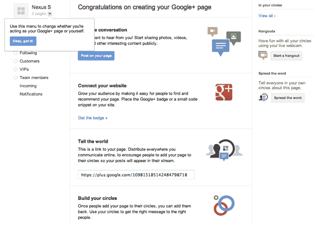

# Google+推出网页，为品牌(和其他一切)打开闸门

> 原文：<https://web.archive.org/web/https://techcrunch.com/2011/11/07/google-launches-pages-opens-floodgates-for-brands-and-everything-else/>

Google+朝着成为脸书的全面竞争对手迈出了重要的一步:它推出了 Google+页面，允许品牌、产品、公司、企业、地点、团体和其他所有人在这项服务上建立存在。该产品很像脸书页面，但有一个主要区别:谷歌正在将 Google+页面的一些元素深入到其基本搜索产品中。

来到这里是一条艰难的路。你可能还记得，当 Google+首次推出时，谷歌要求品牌和出版商*而不是*为他们自己的网站创建页面，并承诺很快会有一个官方解决方案。并非所有人都注意到了谷歌的要求(事后来看，TechCrunch 也不应该这么做)，但谷歌没有应用自己的规则，而是开始制造例外。许多人感到不安，TechCrunch 的一名新员工被[催生了](https://web.archive.org/web/20230205023242/https://techcrunch.com/2011/07/21/techcrunch-google-plus-account/)(并被毫不客气地禁止)，谷歌 SVP·维克·冈多特拉后来继续说，“[的磨难很可能是一个错误](https://web.archive.org/web/20230205023242/https://techcrunch.com/2011/07/21/vic-gundotra-on-how-google-handled-brands-it-was-probably-a-mistake/)”。

总之。现在 Google+页面正式推出，这是一个好消息。

我还没有开始使用新的页面功能，但产品副总裁兼 Google+项目负责人之一布拉德利·霍洛维茨向我展示了一组幻灯片，概述了它们是如何创建的，以及用户将如何使用它们。

Horowitz 做的第一件事是背诵一些统计数据:这项服务在 100 多天前推出，现在有 4000 万用户和 34 亿张上传的照片，并推出了 100 多项新功能。不错的开始。到页面上。

如果你之前已经建立了一个 Google+个人资料，那么通过页面提供的功能将会很熟悉。您可以将人们放入圈子中，这样您就可以与特定的用户群共享内容。您可以发起视频聊天，让您与您的关注者进行面对面的对话。这些页面通过该网站的移动应用程序运行。

【YouTube = ' http://www . YouTube . com/watch？& v = NY8L _ sznr 70 ']

但是谷歌已经做了一些关键的调整。首先，在用户已经将页面添加到他们的一个圈子之前，页面不能将某人添加到圈子中。换句话说，在你选择将他们加入你的圈子之前，一个页面不能开始向你发送消息。另一个重要的变化是:页面上的内容默认为公开的(相对于个人资料的“我的圈子”)，页面不能与扩展圈子共享。

还有一个让我最不满的功能:页面上有一个+1 按钮和一个“添加到圈子”按钮。后者允许页面开始向您发送更新。和+1 按钮呢？它基本上什么都不做，至少对用户来说是这样。

是的，你的+1 推荐可能会在某个时候出现在朋友的搜索查询中，但这并不是一个强有力的激励。那么这有什么意义呢？Horowitz 承认,+1 按钮仍然有点不透明，但他说，当用户点击它时,“我们还没有完全意识到会发生什么”,我们可以期待一些大事情很快就会发生。他补充说，你主页上的+1 按钮和你的 Google+页面是链接在一起的(换句话说，如果你+1 TechCrunch.com，就相当于+1 我们的 TechCrunch Google+页面)。

不过，我仍然认为两个按钮之间的选择会让用户感到困惑。

最后，还有与搜索的集成，这在几周前就已经预示出来了。多年来，谷歌搜索允许用户使用“+”操作符创建高级查询，这允许你找到包含精确术语的结果。随后，令许多高级用户懊恼的是，谷歌宣布取消这一功能。

今天，我们来看看为什么:当用户在谷歌上输入“+TechCrunch”时，他们会被问及是否愿意将 TechCrunch 加入他们的 Google+圈子。如果他们说是，那么这个行为就变成了自动的:我可以输入+哈利波特+安卓，然后立即开始跟踪这两个页面，假设它们存在。当然，这种行为并不完全自然。但霍洛维茨指出，品牌可以开始为它做广告——不难想象预告片以“+MovieTitle”结尾，就像他们对“脸书上的我们”徽章做的那样。

谷歌将这一功能描述为与合作品牌的直接连接。如果你想设置它，你需要创建你的 Google+页面，然后将一段代码添加到你的品牌(或出版商，或其他什么)的相关官方网站。一旦谷歌的爬虫“看到”这个代码，这可能需要一段时间，连接将被验证，用户将能够在谷歌搜索中使用“+”功能。

**更新**:显然目前只有部分用户可以创建谷歌页面——你可以在这里查看你的账户是否启用了[。](https://web.archive.org/web/20230205023242/https://plus.google.com/pages/create)

