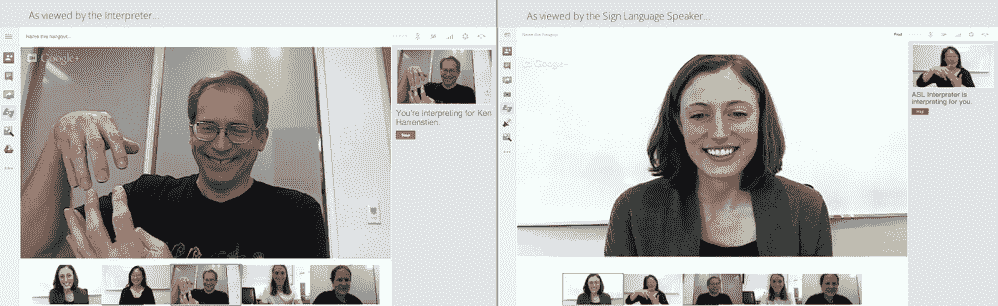

# 谷歌推出 Hangouts 手语翻译应用，为 Gmail、Drive 和 Chrome 添加辅助功能 

> 原文：<https://web.archive.org/web/https://techcrunch.com/2013/03/01/google-launches-sign-language-interpreter-app-for-hangouts-adds-accessibility-features-to-gmail-drive-and-chrome/>

# 谷歌推出 Hangouts 手语翻译应用，为 Gmail、Drive 和 Chrome 添加辅助功能

在本周举行的 [CSUN 国际科技和残疾人大会](https://web.archive.org/web/20221005123923/http://www.csun.edu/cod/conference/2013/sessions/index.php)上，谷歌[宣布](https://web.archive.org/web/20221005123923/http://googleblog.blogspot.com/2013/02/making-cloud-more-accessible-with.html)它已经为 Chrome、Chrome OS、Gmail 和 Google Drive 增加了一些辅助功能，这应该会让盲人和弱视用户更容易使用谷歌的网络应用套件。此外，谷歌还[推出了](https://web.archive.org/web/20221005123923/https://plus.google.com/117291608766433950060/posts/Z1PV8ng3HxU)新的手语翻译应用程序和键盘快捷键，用于聋人和听力障碍者，以及那些不能或不想使用鼠标的人。

谷歌写道，ChromeOS 现在具有新的“高质量的文本到语音转换语音”(目前只有英语版本)，以及屏幕放大和高对比度模式。Gmail 现在有一个新的导航界面和键盘快捷键，使用了 HTML5 ARIA 标准，这意味着丰富的互联网应用程序更容易访问。

据谷歌称，现在使用键盘访问 Drive[也容易多了。在 Docs 中，谷歌写道，“你可以使用键盘访问功能，以一种新的方式搜索菜单和工具栏选项。新的键盘快捷键和动词化改进也使使用屏幕阅读器更容易使用文档、表格和幻灯片。”](https://web.archive.org/web/20221005123923/http://support.google.com/a/bin/answer.py?hl=en&answer=3005618&topic=3001594&ctx=topic)

谷歌还指出，Chrome 的稳定版本现在包括对网络语音 API 的支持，因此开发人员可以将语音识别集成到他们的应用程序中。无障碍在线图书馆 Bookshare 在 CSUN 会议上展示了 ReadNow 电子书阅读器的一个版本，该版本已经使用了语音 API。

## Hangouts 解释器应用程序

至于 [Hangouts 口译应用](https://web.archive.org/web/20221005123923/https://plus.google.com/hangouts/_?gid=532733437531)，谷歌表示，它将允许那些喜欢手语的人“在 Hangouts 期间邀请口译员为他们说话和签名。”来自口译员的实时视频将始终显示在窗口的右上角。

