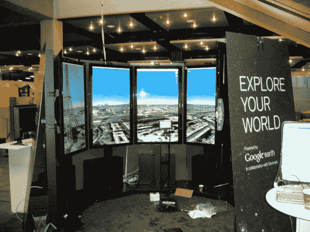

# 谷歌最酷的 20%项目:灵动银河 

> 原文：<https://web.archive.org/web/https://techcrunch.com/2009/12/07/google-liquid-galaxy/>

# 谷歌最酷的 20%项目:液态银河

在今年的谷歌 I/O 大会上，一个演示展台脱颖而出:[全息甲板](https://web.archive.org/web/20221006131504/http://www.beta.techcrunch.com/2009/05/31/video-inside-the-google-holodeck/)。它基本上是八个巨大的长屏幕，排列成一个圆圈，显示谷歌街景图像。当你走进这个奇妙的装置时，有点像在外面跑来跑去。今天，谷歌花时间向[解释了一下这个项目](https://web.archive.org/web/20221006131504/http://google-latlong.blogspot.com/2009/12/sometimes-eight-screens-are-better-than.html?utm_source=feedburner&utm_medium=feed&utm_campaign=Feed:+blogspot/SbSV+(Google+LatLong))，它现在称之为“液体星系”

显然，改名的原因是这个摊位现在展示的不仅仅是街景。谷歌制作了一个修改过的谷歌地球客户端，现在你可以通过这个设备去世界上的任何地方。你甚至可以带着它去月球和火星。这感觉更像是一次旅行，而不是一个电脑程序，介于观景台和玻璃墙的宇宙飞船之间。由于这种完全无缝的沉浸式体验，我们决定将其命名为 Liquid Galaxy ，”谷歌写道。

虽然该公司指出，这在很大程度上仍然是他们 20%的项目，但他们“正在努力改善它。”希望这意味着两件事:1)把它变成星际迷航式的全息甲板。2)找出如何使其内部温度低于 10，000 度(感谢所有的屏幕热量)。

下面，观看我们今年从 Google I/O 上拍摄的视频。谷歌指出，它目前正在世界各地参加各种技术会议。他们的校园里显然也有一些。

【YouTube = http://www . YouTube . com/watch？v=0zpKwPe-GqQ&w=640&h=505]

