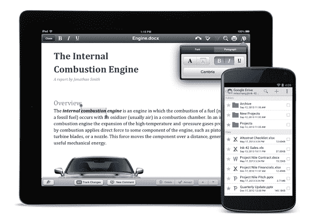

# 谷歌为所有人免费提供 iOS 和 Android 版 Quickoffice 

> 原文：<https://web.archive.org/web/https://techcrunch.com/2013/09/19/google-makes-quickoffice-for-ios-and-android-free-for-everyone/>

# 谷歌为每个人免费提供 iOS 和 Android 版的 Quickoffice

距离[谷歌收购 Quickoffice](https://web.archive.org/web/20221207013005/https://beta.techcrunch.com/2012/06/05/google-acquires-mobile-productivity-company-quickoffice/) 已经一年多了，Quickoffice 是一款在平板电脑上编辑微软 office 文件的移动应用。在过去的几个月里，谷歌通过向商业用户免费提供谷歌应用程序，慢慢扩大了该工具的可用性。其他人仍然需要为应用付费。然而，今天，它改变了这一政策，向任何拥有谷歌账户的人免费提供适用于 [iOS](https://web.archive.org/web/20221207013005/https://play.google.com/store/apps/details?id=com.quickoffice.android) 和 [Android](https://web.archive.org/web/20221207013005/https://itunes.apple.com/us/artist/quickoffice-inc./id294258240?mt=8) [的 Quickoffice。](https://web.archive.org/web/20221207013005/http://googleenterprise.blogspot.com/2013/09/freeing-quickoffice-for-everyone.html)

正如谷歌在其声明中哀叹的那样，虽然将文档转换成谷歌文档、表格和幻灯片很容易，但“有时你的同事还没有谷歌”该公司似乎在暗示，使用 [Quickoffice](https://web.archive.org/web/20221207013005/http://www.quickoffice.com/) 处理 office 文件是一种合理的妥协，尤其是考虑到这些文件保存在 Google Drive 上。

当前的 Quickoffice for Google Apps for Business 用户可以将他们的应用程序更新到新版本，并在此过程中获得许多新功能。例如，该应用程序现在可以创建。ZIP 文件夹，并允许您在 Excel 和 PowerPoint 中查看图表。谷歌强调，它还可以跨设备运行，“所以当你从使用手机到在平板电脑上编辑时，你再也不用担心安装单独的版本了。”

为了增加交易的甜头，谷歌将在未来两年内向任何在 9 月 26 日之前登录新的 Android 或 iOS 版 Quickoffice 应用程序的人额外提供 10GB 的 Google Drive 存储空间。

今年早些时候，谷歌还表示，它将使用其原生客户端技术，将 Quickoffice 带到浏览器 T1 中。然而到目前为止，我们还没有听到太多关于网页版的消息。然而，现在所有人都可以免费使用移动应用，推出网络应用的机会也不远了。