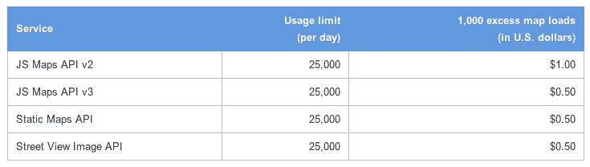

# 谷歌地图 API 在开发者叛逃后大幅降价 

> 原文：<https://web.archive.org/web/https://techcrunch.com/2012/06/22/google-maps-api-gets-massive-price-cut-in-the-wake-of-developer-defections/>

# 谷歌地图 API 在开发者叛逃后大幅降价

自从谷歌[引入](https://web.archive.org/web/20221228045544/http://googlegeodevelopers.blogspot.com/2011/10/introduction-of-usage-limits-to-maps.html)限制开发者可以免费 ping 其流行的地图 API 的频率，并开始对超过这些限制的开发者收费以来，我们已经看到许多著名的开发者，如 [Foursquare](https://web.archive.org/web/20221228045544/http://foursquare.com/) 转向其他平台，包括[开源项目 OpenStreetMap](https://web.archive.org/web/20221228045544/http://www.openstreetmap.org/) 。现在，看起来谷歌已经注意到，它不能继续对超过免费限额的 1000 个地图加载收取高达 4 美元的费用。相反，该公司刚刚[宣布](https://web.archive.org/web/20221228045544/http://googlegeodevelopers.blogspot.com/2012/06/lower-pricing-and-simplified-limits.html)将大幅[降低其定价](https://web.archive.org/web/20221228045544/https://developers.google.com/maps/faq#usage_pricing)至每 1000 次地图加载仅 0.50 美元。

和以前一样，一旦开发者超过连续 90 天每天 25000 次地图加载的免费使用限制，谷歌将开始向他们收费。根据谷歌的数据，目前只有大约 0.35%的网站经常超过这些限制。和以前一样，谷歌不会自动执行这些限制，但会联系经常超过这些限制的开发者，讨论他们的选择。谷歌说，这保证了你的网站不会因为“突然流行起来”而停止工作。

除了降价之外，谷歌还取消了以前对 T4 风格地图和非风格地图的区分。开发者可以根据自己的喜好调整风格化地图，以前免费使用的限制较低(每天 2500 次)，对于每天超过 25000 次地图加载的用户，价格较高。

谷歌在一年一度的谷歌 I/O 开发者大会即将召开的前几天宣布这一消息，可能并不令人惊讶。毕竟，最初的定价变化在谷歌开发者社区中引起了相当多的不安，随着这个话题的解决，该公司将不必面对更多关于这个话题的问题。