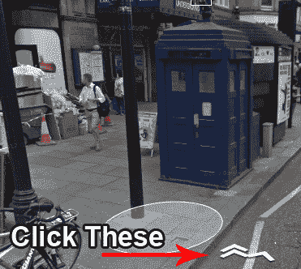

# 谷歌地图复活节彩蛋让你探索 TARDIS 

> 原文：<https://web.archive.org/web/https://techcrunch.com/2013/08/13/google-maps-doctor-who-tardis-easter-egg/>

# 谷歌地图复活节彩蛋让你探索 TARDIS

喘息！我本该在 20 分钟前就写好这篇文章的，但是我太忙了。

一个新发现的谷歌地图复活节彩蛋藏在一张看起来只是一个警察岗亭的街景图片中，让你可以进入 TARDIS T3 的 T2。

(如果不知道太史慈是什么， *[加油。](https://web.archive.org/web/20221225195320/http://en.wikipedia.org/wiki/TARDIS)* )

**怎么做:**

*   点击此[链接](https://web.archive.org/web/20221225195320/https://maps.google.com/maps?hl=en&ll=51.492159,-0.19092&spn=0.005291,0.013937&sll=51.492140,-0.193028&layer=c&cid=12502927659667388442&panoid=c9UMhWP_MWm9U0L48xEjYw&cbp=13,291.8,,0,18.86&gl=US&t=m&cbll=51.492132,-0.192862&z=17)
*   移动你的鼠标一点。应该会弹出标准的谷歌地图方向箭头，还有一个小的附加功能:一对双箭头。点击这些。(注意:如果你注册了新的谷歌地图用户界面测试版，箭头可能不会出现。相反，按键盘上的向上键。谢谢你的提醒，[埃里克](https://web.archive.org/web/20221225195320/https://twitter.com/etschuetz/status/367346189298958338)！如果它仍然对你不起作用，请看这篇文章底部的注释。)
*   嘭！你现在应该在 TARDIS 的内大(外小)内部。

我以为这只是一个单一的静态镜头，但没有:你可以在控制室周围点击，完成街景的标志性全景，一路导航到主平台下方，一瞥 TARDIS 本身的核心。你似乎不能点击进入任何走廊——这可能是更好的，真的，因为我们不希望你们任何人迷路。

**找不到进去的路？寻找这些箭头:**

*男人*，我希望我在建造我的 [AR TARDIS](https://web.archive.org/web/20221225195320/http://www.youtube.com/watch?v=dUBxHd3bMhg) 的时候也有这样的东西。虽然我的内部结构是基于上一代的控制室，但是仅仅从一次性的场景拍摄和屏幕截图中找出内部的所有东西是如何组合在一起的……有点痛苦。

*(注意:据说这个复活节彩蛋并不总是在新的谷歌地图界面上工作，你们中的许多人现在可能已经选择了这个界面。没问题——只要在 Chrome 的匿名模式下打开链接(或者你的浏览器的私人浏览模式可能被称为什么)，你应该会回到旧的谷歌地图界面，而不需要你调整任何设置或退出谷歌。)* 

发现得好，Jalopnik！ ]