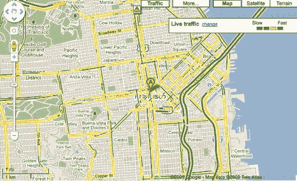

# 谷歌地图现在将向您显示偏僻道路的交通状况 

> 原文：<https://web.archive.org/web/https://techcrunch.com/2009/08/25/google-maps-will-now-show-you-traffic-conditions-on-the-back-roads/>

# 谷歌地图现在会向你显示后面道路的交通状况

任何一个在大城市通勤的人都知道在高峰时间避开高速公路上的车辆时，备用道路的价值。谷歌地图刚刚[增加了](https://web.archive.org/web/20221007213002/http://google-latlong.blogspot.com/2009/08/arterial-traffic-available-on-google.html)一个漂亮的功能，它将向你展示选定城市主干道(非公路)的实时交通状况。谷歌地图还会显示主要高速公路上的交通模式，帮助你了解上下班路上交通流量最少的路线。

当你放大你感兴趣的城市，点击地图右上角的“交通”按钮，你会看到主干道和高速公路的交通状况。对应于交通速度的颜色绿色表示很少或没有交通，黄色表示中度拥堵，红色表示严重拥堵，红色/黑色表示走走停停的交通。

谷歌表示，这项功能也可以在手机版谷歌地图上使用，这在试图找出最佳路线时特别有用。谷歌也[透露了一点](https://web.archive.org/web/20221007213002/http://googleblog.blogspot.com/2009/08/bright-side-of-sitting-in-traffic.html)关于他们如何通过手机上的谷歌地图众包交通信息。当你用我的位置启用谷歌地图时，手机会向谷歌发回匿名数据，描述你的移动速度。当谷歌将你的速度与路上其他手机的速度结合起来，在任何给定的时间，跨越数以千计的手机在一个城市中移动，他们可以了解交通状况。他们不断组合这些数据，并在谷歌地图流量层免费发送给你。

谷歌向用户保证，他们只使用匿名的速度和位置信息来计算交通状况，并且只有当用户选择在他或她的手机上启用位置服务时才这样做。