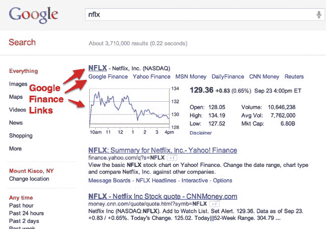

# 谷歌和垄断影院 

> 原文：<https://web.archive.org/web/https://techcrunch.com/2011/09/25/google-monopoly-theater/>

上周三，当我看着谷歌反垄断听证会(T2)的时候，我突然意识到我所看的是一出戏。不是一般的剧院，而是垄断剧院。我借用了[安全剧场](https://web.archive.org/web/20230204230201/http://en.wikipedia.org/wiki/Security_theater)的概念:“一个描述安全对策的术语，旨在提供一种提高安全性的感觉，而实际上很少或根本没有提高安全性。”同样，谈论谷歌的垄断力量以及政府应该对此做些什么，给人一种改善竞争的感觉，而实际上却很少或根本没有改善竞争。

听证会触及了许多关于谷歌市场力量的严重关切，但最终它只是垄断剧场。反垄断监管机构对谷歌做的任何事情实际上都不会改善竞争。

根据听证会上公布的数据，谷歌在美国的搜索市场份额为 65%至 70%，搜索广告份额为 75%，移动搜索份额为 95%，要证明谷歌在搜索领域拥有垄断地位并不困难。然而，垄断本身并不违法。政府必须证明谷歌以反竞争的方式滥用垄断权，才能采取行动，这就是事情变得棘手的地方。

谷歌在很多方面是一个自然垄断者。它得益于自身独特的规模经济。进行搜索的人越多，它收集的数据就越多，这些数据将被注入算法，从而产生更好、更准确的结果。使用谷歌的人越多，它对试图接触他们的搜索广告客户就越有价值。因此，在消费者搜索和广告这两方面都存在微妙的网络效应。

正如马修·英格拉姆在 GigaOm 上的一篇文章中指出的那样，由于谷歌向消费者免费提供其大部分产品，很难说消费者受到了损害。但是对消费者的直接伤害并不是反竞争行为的唯一检验标准。将竞争对手赶出市场的行为可被视为反竞争行为，因为这减少了消费者的选择。

参议院听证会试图解决的主要问题是，谷歌是否越来越多地利用其在搜索领域的主导地位来支持自己的产品，而不是竞争对手的产品。是 Google Places 伤害了 Yelp，还是 Google 产品搜索伤害了 NextTag？确实如此。在 Yelp 的案例中，谷歌使用 Yelp 评论的片段来帮助建立谷歌位置(最近，它[收购了 Zagat](https://web.archive.org/web/20230204230201/https://techcrunch.com/2011/09/08/google-acquires-zagat-to-flesh-out-local-ratings/) )。Yelp 提出抗议，但被告知如果他们不喜欢，他们可以阻止 Yelp 的结果出现在谷歌的任何地方，包括自然结果。这是一个错误的选择，因为 Yelp 75%的流量以某种方式来自谷歌。“不在谷歌就相当于不存在于互联网上，”Yelp 首席执行官杰里米·斯托佩尔曼在听证会上作证。

听证会期间不断出现的另一个例子是谷歌金融结果，当你搜索股票代码时，它会出现在谷歌的顶部，就像当你搜索当地企业时，谷歌位置结果会占用大量空间一样。自 2007 年以来，谷歌一直在展示这些通用搜索结果。如果它能在搜索结果中给搜索者正确的答案，就像一个小的股票图表，它会的。

谷歌董事长埃里克·施密特(Eric Schmidt)在回答一名参议员的问题时说，“在这种情况下，我们不会首先列出任何人。我们先显示摘要，然后显示结果。我不同意那种认为我们在某种程度上歧视他人的说法。”他指出，股票报价下面的第一个自然结果通常是雅虎财经，而谷歌在通用结果本身中提供了竞争财经网站的链接。虽然这都是真的，但股票报价的通用结果中的前三个链接通常会直接指向谷歌财经。如果你点击股票代码或图表本身，就会进入谷歌财经页面，谷歌财经就在股票代码下方，排在雅虎财经、MSN 财经、每日财经、CNN 财经或路透社之前(见下图)。

所有这些看起来都很糟糕，对吧？有了这样的例子，就有可能表明谷歌确实利用其在搜索领域的主导地位来驱使消费者购买其其他产品。难道谷歌金融、谷歌位置和谷歌所有其他非搜索产品的成败不应该取决于它们自身的价值吗？公司向现有客户推出新产品是一种常见的做法，但同样，不同的规则适用于垄断企业。在政府采取行动之前，谷歌自行减少这些行为可能是明智的。

但即使谷歌伤害了特定的竞争对手，也并不意味着它伤害了整个市场。毕竟，谷歌一直在改变它的算法，一些网站在自然结果中上升，另一些网站下降。试图证明是 Yelp 还是 Google Places 提供了更好的结果是非常主观的。只要谷歌能够诚实地辩称，它正试图为消费者提供最好的结果，反垄断法院或政府就很难因此惩罚他们。

即使谷歌滥用其垄断权力，那又如何？对消费者来说，任何强加于谷歌的补救措施都可能比不检查谷歌的不确定后果更糟糕。如果谷歌必须通过反垄断过滤器对其搜索引擎进行每一次修改，这可能会真正破坏搜索，而这正是我们大多数人每天都要依赖的东西。

参议员们似乎意识到了这种可能性，他们反复询问，如果反垄断法庭做出不利裁决，谷歌自己会提出什么补救措施。参议员艾尔·弗兰肯建议成立一个自愿的技术委员会来进行监督，对此谷歌的外部律师苏珊·克雷顿(Susan Creighton)做出了回应(相当正确):“谷歌已经每年改变其算法 500 次。我认为技术委员会太慢，跟不上市场的变化。”

听证会是垄断剧院。它有时也很滑稽。参议员们一直试图给谷歌下定义，并在 2004 年搜索了十个将消费者从谷歌带走的蓝色链接。但是今天的搜索已经大不相同了。谷歌正越来越多地试图在搜索结果中给你正确的答案。你知道还有谁做同样的事情吗？冰。告诉谷歌它需要回到 2004 年的版本，而 Bing 和其他公司可以继续尝试向消费者提供信息的新方法，这只会阻碍搜索领域的创新。

政府和反垄断律师只能向后看。技术变化如此之快，以至于他们强加的任何补救措施都是错误的。看看微软怎么了。它的垄断力量被互联网、谷歌和(最近的)移动计算侵蚀，这些都是在 20 世纪 90 年代它自己的反垄断审判中无法预见的力量。谷歌也将如此。搜索可能会被社交网站取代，成为人们在互联网上发现信息的主要方式，或者一些全新的技术可能会占据主导地位，尽管现在还没有人谈论它。互联网上的垄断不再像过去那样持久。