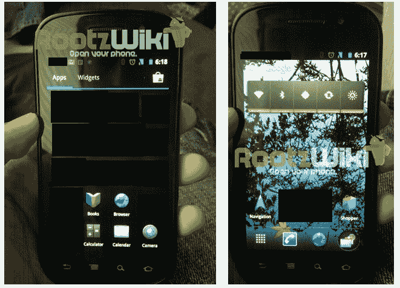

# 谷歌/摩托罗拉的交易并不能保证一个“Nexus Droid”

> 原文：<https://web.archive.org/web/http://techcrunch.com/2011/08/15/google-motorola-deal-doesnt-guarantee-a-nexus-droid/>

在今天早上听到谷歌以 125 亿美元收购摩托罗拉移动公司的消息后，我们都有一个迫切的问题:*这对下一款 Nexus 设备*意味着什么？

谷歌会利用这次收购来制造外观和功能完全符合谷歌期望的安卓手机吗？这一举动将使谷歌更直接地与苹果竞争。或者，它会继续通过现在使用的同样程序，将一家手机制造商捧为安卓设备的临时“国王”？

根据 Android 首席执行官安迪·鲁宾今天早上的声明，将是后者。他说，谷歌预计此次收购不会影响 Nexus 项目和领先设备战略。“我们在每年圣诞节前后选择一家制造商发布一款手机，”鲁宾解释道。"收购完成后，摩托罗拉将成为竞标过程和主导设备流程的一部分."

从字里行间来看，鲁宾似乎在说，我们不应该指望很快看到新的 Nexus 品牌的“Droid”，尤其是在今年冬天选择新的 Nexus 设备时。

这一声明似乎与之前关于哪家制造商将生产新款 Nexus 手机的传言相吻合。据[各种](https://web.archive.org/web/20230205030528/http://www.bgr.com/2011/06/27/googles-first-ice-cream-sandwich-phone-to-be-manufactured-by-samsung-possibly-dubbed-nexus-prime) [报道](https://web.archive.org/web/20230205030528/http://rootzwiki.com/content.php?r=221-Ice-Cream-Sandwich-Pics-RootzWiki-Exclusive)称，摩托罗拉今年甚至没有参加竞选。例如，Android 追踪博客 [AndroidandMe](https://web.archive.org/web/20230205030528/http://androidandme.com/2011/07/news/rumor-nexus-3-lottery-down-to-htc-samsung-and-a-really-big-surprise/?utm_source=rss&utm_medium=rss&utm_campaign=rumor-nexus-3-lottery-down-to-htc-samsung-and-a-really-big-surprise) 在 7 月份指出，竞标制造新 Nexus 设备的四家制造商包括三星、HTC、索尼爱立信和 LG。也有一个微小的可能性，一个“惊喜”的设备采用英特尔 CPU。

很可能上述部分或全部确实正在被谷歌评估和考虑为新的“Nexus”，这将是第一款运行 Android 4.0 的手机，又名“冰淇淋三明治”。

*上图:三星设备上 Android 4.o(据报道)的泄露照片，来源: [Rootzwiki](https://web.archive.org/web/20230205030528/http://rootzwiki.com/content.php?r=221-Ice-Cream-Sandwich-Pics-RootzWiki-Exclusive)*

**谷歌选择 Nexus 代工需谨慎**

Nexus 品牌的智能手机是谷歌的 Android 旗舰设备，旨在展示最新版本的移动操作系统(OS)，没有受到设备制造商和运营商的任何篡改。尽管这些手机没有制造商的修补——原始设备制造商通常将修补宣传为一种功能，而不是缺点——但赢得 Nexus 的竞标被视为一种荣誉。Nexus 手机是 Android 开发者的首选设备，这是每个 OEM 厂商都想占领的市场。

事实上，HTC 首席执行官 Peter Chou [喜欢吹嘘他的公司拥有除谷歌之外最大的 Android 开发者群体。通过 Nexus 设备吸引开发者的注意力意味着对 HTC 自己的以开发者为中心的计划有更多的潜在兴趣，如其新推出的 HTCDev.com 和 OpenSense SDK(一种让开发者将他们的应用程序皮肤化，看起来像是 HTC 自己用户界面的一部分的工具)。其他制造商也有类似的兴趣，比如,](https://web.archive.org/web/20230205030528/http://www.readwriteweb.com/mobile/2011/06/htc-opens-sense-ui-to-developers-opensense-new-htc-dev-program.php)[三星的](https://web.archive.org/web/20230205030528/http://innovator.samsungmobile.com/platform.main.do?platformId=1)为其 Galaxy Tab 设备推出更多 Android 平板应用，或者[索尼爱立信的](https://web.archive.org/web/20230205030528/http://developer.sonyericsson.com/wportal/devworld/technology/android/get-started?cc=gb&lc=en)吸引游戏开发者为其 Xperia PLAY 开发游戏。

还有一个事实是，许多消费者也越来越喜欢 Nexus 手机，它不仅提供完整的谷歌体验，而且在有更新和新功能时也是第一个获得的。这是早期采用者的首选设备，因为它使他们能够站在移动技术创新的前沿。这也是任何原始设备制造商想要的利基。

让所有未来的 Nexus 设备都成为摩托罗拉手机很容易激怒谷歌的 Android 合作伙伴，他们已经对这次收购在优惠待遇方面对他们意味着什么感到紧张。谷歌必须小心，不要在 Nexus 的竞争中公开偏袒摩托罗拉，否则就会面临合作伙伴被微软的 Windows Phone 甚至惠普的 webOS 等竞争对手抢走的风险。

然而，这并不排除摩托罗拉制造 Nexus 手机(或平板电脑)的可能性。)在未来，这只是意味着这是谷歌知道它必须小心行事的一个领域。