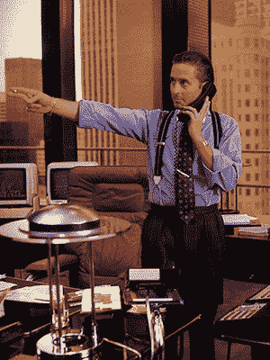
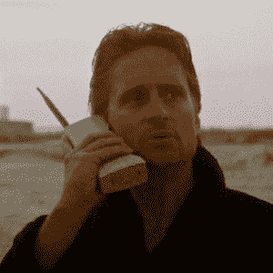

# 谷歌，别废话了，给戈登盖柯演讲吧 

> 原文：<https://web.archive.org/web/https://techcrunch.com/2010/08/13/google-net-neutrality/>

在过去的几天里，我一直在用书签标记关于谷歌、威瑞森和网络中立的帖子，以便以后阅读。在过去的几个小时里，我一直在这样做，但几乎没有取得任何进展。似乎每个在网上写过字的人都对这种情况感到愤怒。令人惊奇的是，几乎所有的人都同意。对于*为什么*谷歌要出卖我们，还没有明确的共识，但是共识是他们是。

我不得不同意。此外，[谷歌](https://web.archive.org/web/20230207135329/http://googlepublicpolicy.blogspot.com/2010/08/facts-about-our-network-neutrality.html)对今天的反弹的回应陈述了他们与威瑞森的提议的“事实”，这让我有点恼火。

在我开始之前，让我声明一下，我崇拜的公司屈指可数，因为我喜欢他们的产品。谷歌就是其中之一。当然，比起安卓手机，我更喜欢 iPhone 但比起几年前智能手机革命开始前的垃圾手机，我更喜欢安卓手机。在我一天做的所有事情中，我肯定我使用谷歌产品最多。Gmail，谷歌阅读器，Chrome，谷歌搜索。都是纯金的。谷歌是一家伟大的公司。

这就是为什么他们在网络中立性方面的所作所为如此令人失望。

鉴于本周，人们对谷歌的非官方座右铭“不要作恶”议论纷纷。谷歌现在一定很邪恶吧？不——那太荒谬了。似乎有这种倾向，认为当公司做一些不利的事情时，他们一定有恶意。我在之前就已经[声明过了，但是我要再次声明:这不是一部詹姆斯·邦德电影，在这部电影中，一些恶棍仅仅因为自己邪恶就想做坏事。](https://web.archive.org/web/20230207135329/https://techcrunch.com/2010/06/05/facebook-steve-jobs-dog-day-afternoon/)

相反，谷歌的意图要明显得多:贪婪。贪婪也往往有负面的含义，但我是戈登·盖柯式的“贪婪行得通”这是这个国家的动力。作为一家上市公司，不管我们愿不愿意承认，这是谷歌的驱动力。

问题是谷歌自己不愿意承认贪婪是问题所在。他们仍然试图假装这一切都是为了我们好。这是侮辱。

对我们最有利的是网络中立，纯粹而简单。

如果谷歌的某个人站起来发表戈登盖柯式的演讲，讲述他们对扩张和达成交易的热情，那就更容易让人接受了。至少不会这么虚伪。

问题的部分原因可能是谷歌的高层又一次出现了分歧。我们在中国局势中看到了这一点[。据说 Sergey Brin 不想屈服于中国的任何要求，在 mainland China 境内运作，但 Eric Schmidt 说服了他。最后咬了他们的屁股。这是一个什么对公司最好，什么是正确的情况。这是同样的情况。](https://web.archive.org/web/20230207135329/https://techcrunch.com/2010/01/17/the-price-of-google-in-china/)

在过去几天与谷歌员工和前谷歌员工的私下交谈中，绝大多数人似乎也对谷歌在这里的所作所为感到不安。一些人购买了谷歌的公司线，谷歌正在做他们唯一能做的事情，以完成一些事情。但大多数人似乎都同意，这是一个太滑的斜坡，不能玩下去。

当然，我假设你已经了解了谷歌和威瑞森关于网络中立的联合提案的一些细节。如果你不是，它基本上归结为双方达成协议，有线连接的大部分将属于完全网络中立。同时，他们也同意无线网络在很大程度上不应该——至少现在不应该。

两者的关键词都是“大部分”。就有线方面而言，仍有一部分会让提供商有能力用自己的服务(在拟议的政府监管下)绕过这种中立性。有了无线网络，它更像是一个狂野的西部。这种观点认为，事情仍在发生变化，竞争也很激烈。

这两种观点都是错误的，因为两者都极其灰暗。两者都开创了一个可怕的先例(当然，如果被采纳的话)。

为了让网络中立性真正发挥作用，我们需要非黑即白的东西。或者真的只是白色。无论涉及什么类型的数据、什么公司或什么服务，互联网都需要流动。故事结束。

这似乎是谷歌以前的立场。但现在不是了。

显然，运营商和服务提供商不想要这种完全的网络中立性。他们希望能够根据所提供的服务收取不同金额的费用。他们认为，他们需要向前发展(特别是在无线网络方面)，以确保网络的稳定性。我的猜测(根据我对运营商和有线电视提供商的了解)是，这主要是胡说八道——都是为了赚更多的钱。

在未来，钱都将是无线的，所以他们愿意接受有线方面不太有利的安排也就不足为奇了。

在他们今天的回应中，谷歌基本上不断重申某种妥协是必要的。他们甚至用“政治现实”这个词——唉。谷歌的理查德·惠特指出:“我们并不是说这个解决方案是完美的，但我们相信，一个为消费者锁定关键的可强制执行的保护措施的提案总比完全没有保护要好。

再次，这是一个问题；解决方案*需要*变得完美，否则可能根本没有解决方案。谷歌表示，如果没有折衷的解决方案，该系统可能会完全转向运营商和供应商的分层套餐。首先，这听起来像 FUD。其次，在这种情况下，这是一个值得冒的风险。谷歌需要在这里站稳脚跟。要么全有，要么全无。

但同样，他们也不想这么做。这种妥协确保了资金的持续流动。他们会选择不与威瑞森或任何其他航空公司打交道吗？当然可以。但事实并非如此。事实是，他们需要管道和钱。

这就是为什么谷歌处境艰难。他们可能想做正确的事，但他们不能牺牲业务来实现这一目标。

同样，我对这一切的问题是明显的误导。谷歌认为妥协的解决方案胜过没有解决方案的论点，对他们的好处远远超过对我们的好处。然而，这正是他们试图扭转局面的方式。他们这样做是为了我们。天啊。谢谢。

如果你真的想为我们做点什么，坚持你的网络中立立场。不要让威瑞森、美国电话电报公司、康卡斯特或任何其他开玩笑的人胁迫你做出任何妥协。其他公司会支持你。但你必须领导。

它可能最终以失败告终。但是嘿，[你庆祝失败](https://web.archive.org/web/20230207135329/https://techcrunch.com/2010/08/04/google-wave-eric-schmidt/)。你应该的。大风险，大回报，诸如此类。

或者，更好的是，扩展您出色的宽带计划。所有这些背后的真正问题是，有线和无线连接生态系统中几乎没有足够的竞争。这个国家的很大一部分人在宽带提供商方面别无选择。对于无线运营商来说，选择也好不到哪里去(不管谷歌和威瑞森怎么说)。我们两者都需要更多的竞争——有了竞争，网络中立的争论可能会让位于自然选择。

没有足够的公司有资源来培养这种类型的竞争。但谷歌是其中之一。事实上，他们[可能是那里唯一的希望](https://web.archive.org/web/20230207135329/https://techcrunch.com/2010/03/21/google-national-broadband-plan/)。

对完全网络中立的坚定立场可能看起来风险太大，或者更糟，是徒劳的。但这是谷歌在这里采取的唯一合适的立场。我们将他们加冕为互联网之王。现在是他们为我们而战的时候了。

或者，如果他们不打算这么做，至少是时候承认金钱是真正的激励因素了。他们在网络中立性上妥协对我们没有任何好处。他们在给自己做一个。

*女士们，先生们，关键是，贪婪，因为没有更好的词，是好的。贪婪是对的，贪婪是有用的。贪婪澄清、穿透并抓住了进化精神的本质。各种形式的贪婪；对生命、金钱、爱情、知识的贪婪标志着人类的向上涌动。记住我的话，贪婪不仅会拯救泰达纸业，还会拯救另一家运转不良的公司美国。谢谢您们。*

【YouTube = http://www . YouTube . com/watch？v=7upG01-XWbY&w=630]

**更多:**

*【图片:20 世纪福克斯】*