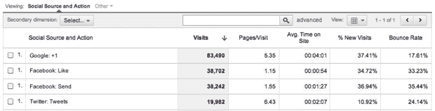

# 谷歌现在让网站所有者衡量+1(和任何其他社交工具)的力量

> 原文：<https://web.archive.org/web/http://techcrunch.com/2011/06/29/google-now-lets-website-owners-measure-the-power-of-1-and-any-other-social-widget/>

# 谷歌现在让网站所有者衡量+1(和任何其他社交工具)的力量

早在三月份，谷歌正式开始在其搜索结果中推出 [+1 按钮](https://web.archive.org/web/20230204073058/https://techcrunch.com/2011/03/30/google-plus-one/)，允许用户投票选出他们认为最有用的页面。两个月后，在 6 月 1 日，它推出了一个小工具，让网站所有者将按钮集成到他们的页面上，就像他们对脸书的“喜欢”和 Twitter 的“推特”按钮所做的那样。

但是，呃，不太清楚[的重点是什么](https://web.archive.org/web/20230204073058/https://techcrunch.com/2011/06/10/see-you-in-another-life-brother/)。人们不断点击这个按钮，但效果——为我们的朋友提供更好的搜索结果——并不明显。网站所有者也不清楚这个按钮的影响有多大。

今天，这种情况发生了变化:谷歌刚刚宣布+1 的数据将显示在谷歌的网站管理员工具中，让网站所有者可以确切地看到+1 的影响有多大。你现在可以看到一个页面总共有多少+1，以及这对点击率有什么影响。

谷歌还有另一个锦囊妙计——它还将为你提供对你安装的任何其他社交工具的分析，比如脸书的“喜欢”按钮。**更新**:这个功能需要网站管理员添加一段额外的代码，参见谷歌贴子的说明。

以下是谷歌如何分解社交小工具的新功能:

*   社交参与报告可让您了解包括点击+1 按钮或其他社交活动的访问的网站行为如何变化。这让你可以确定，比如，在访问期间+1 你的页面的人是否比不+1 的人在你的网站上花更多的时间。
*   社交活动报告可以让你在一个地方跟踪你的网站上的社交活动(+1 点击，推文等)的数量。
*   社交页面报告允许您比较您站点上的页面，以查看哪些页面推动了最高数量的社交活动。

与网站所有者相比，*用户*的+1 价值可能不仅来自改进的搜索结果，还来自与 Google+的整合，Google+是谷歌昨天推出的社交网络。当然，这是假设，一旦它向所有人推出，人们会继续使用它(到目前为止，我很喜欢它)。

