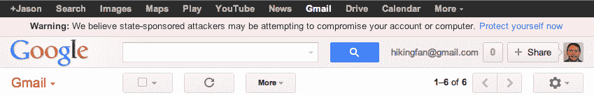

# 如果谷歌怀疑你是“国家支持的攻击”的目标，它会警告你

> 原文：<https://web.archive.org/web/http://techcrunch.com/2012/06/05/google-now-warns-you-if-it-suspects-youre-the-target-of-a-state-sponsored-attack/>

# 如果谷歌怀疑你是“国家支持的攻击”的目标，它现在会警告你

显然，谷歌发现一些用户的账户受到“国家或国家支持的团体”的攻击并不罕见。这种攻击似乎如此普遍，以至于谷歌现在[推出了](https://web.archive.org/web/20230209125025/http://googleonlinesecurity.blogspot.com/2012/06/security-warnings-for-suspected-state.html)一个新的程序，当它检测到这种攻击时会警告用户。每当 Google now 检测到某个帐户受到攻击时，它会在用户屏幕的顶部显示一条警告，包括一个链接，指向一个包含如何最好地保护您的 Google 帐户的附加信息的页面。

正如谷歌安全工程副总裁 Eric Grosse 在今天的公告中指出的，谷歌已经设置了“额外的路障，以阻止这些坏人”每当它看到这样的攻击发生时。当然，谷歌不想透露它是如何知道特定攻击可能是国家支持的，但格罗斯说，谷歌的“详细分析——以及受害者报告——强烈表明国家或国家支持的团体的参与。”格罗斯还指出，这些警告并不一定意味着账户已经被劫持。

为了保护您的帐户(即使您不怀疑某个流氓国家可能会对您存储在 Google Drive 上的任何内容感兴趣)，Google 建议您小心潜在的网络钓鱼攻击，并且您“创建一个由大写字母和小写字母以及标点符号和数字组成的唯一密码；启用两步验证作为额外的安全性；并更新您的浏览器、操作系统、插件和文档编辑器。”

例如，谷歌已经公开[谈论](https://web.archive.org/web/20230209125025/http://online.wsj.com/article/SB10001424052702303657404576359770243517568.html)中国活动人士和记者的账户在 2011 年是如何被侵入的。谷歌[也指责中国](https://web.archive.org/web/20230209125025/http://www.wired.com/threatlevel/2010/01/operation-aurora/)在 2010 年对其网络的[攻击(尽管它从未直接指责中国政府是这些黑客攻击其系统的幕后黑手)。](https://web.archive.org/web/20230209125025/https://techcrunch.com/2010/01/12/google-china-attacks/)

