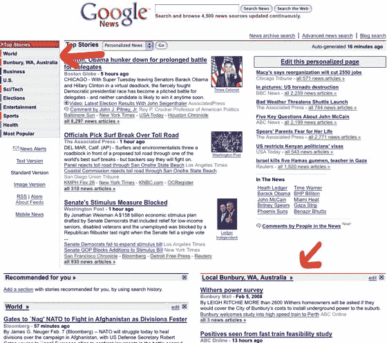

# 当心 Topix——谷歌推出本地化新闻服务 TechCrunch

> 原文：<https://web.archive.org/web/https://techcrunch.com/2008/02/07/google-offers-localized-news-service/>

# 当心 Topix——谷歌推出本地化新闻服务

 [Topix](https://web.archive.org/web/20230219035330/http://www.topix.com/) 因[聚合](https://web.archive.org/web/20230219035330/https://techcrunch.com/2006/08/08/topixnet-finally-usable-after-relaunch/)数万个地方新闻源并聚合到网上而出名(他们[也喜欢](https://web.archive.org/web/20230219035330/https://techcrunch.com/2007/04/01/5497/)公民记者)。谷歌扩大他们的新闻产品，与 Topix 展开更直接的竞争，这只是时间问题。这一时刻已经到来——今天，谷歌在其谷歌新闻服务中增加了一个定制本地新闻的选项。

本地化选项现在在 news.google.com 上可用，但似乎尚未推广到特定国家的新闻门户网站。使用这项服务非常简单，只需在本地新闻选项框中输入你的邮政编码或位置，当你访问谷歌新闻时，这个选项框就会自动出现。

该功能根据您的位置提取新闻故事，并作为一个子部分显示在主谷歌新闻页面上，还有一个侧边栏菜单项和专门的页面。

根据谷歌的[:](https://web.archive.org/web/20230219035330/http://googlenewsblog.blogspot.com/2008/02/all-news-is-local.html)

> 与往常一样，结果将与一个故事的多个来源聚集在一起。给定区域的头条新闻将位于搜索结果的顶部。我们的文章排名还会考虑出版物的位置，这样我们就可以推广每个故事的所有本地来源。

谷歌新闻比 Topix 吸引了更多的观众——每月 4700 万，而 Topix 只有 620 万(康姆斯克，2007 年 12 月全球观众),但直到现在他们还没有提供良好的本地新闻报道。东证现在面临一些严峻的竞争。

