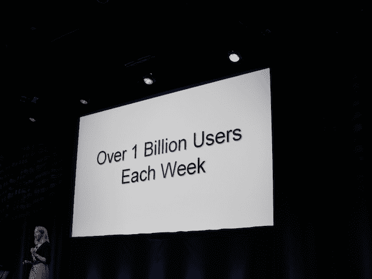

# Google 现在每周为 10 亿用户提供服务 

> 原文：<https://web.archive.org/web/https://techcrunch.com/2010/09/08/google-one-billion/>

# 谷歌现在每周服务 10 亿用户

今天，在旧金山的谷歌搜索活动上，高管玛丽莎·梅耶尔以一个大州开始了事情:谷歌现在每周服务 10 亿用户。

梅耶尔指出，他们今天将有一些重大宣布(可能是这些)，但首先重申他们今年已经做了很多。2009 年，谷歌推出了 500 个用户界面和排名变化——到 2010 年为止，他们已经超过了这个数字。梅耶尔说:“*今年将是谷歌搜索*有史以来最好的一年。”。

梅耶尔指出，今年迄今为止的一些大事是咖啡因(结果快了 50%)、实时、拼写纠正、问答、搜索之星和重新设计(左侧面板)。

梅耶尔还提到了谷歌的第一个电视广告，该广告在今年的超级碗期间播出。她还提到了他们的愚人节玩笑(将谷歌重新命名为“托皮卡”)。最后，她指出“*在过去的几天里，我们一直在拿我们的标志*开玩笑。”我们显然已经注意到了。这是今天将要发生的事情的一个暗示。

梅耶尔说，今天的主题是“搜索的根本转变”。

点击这里关注我们的实时博客[。](https://web.archive.org/web/20230217115550/https://techcrunch.com/2010/09/08/google-search-event-2/)

**更新**:这里是 [Google Instant:在你输入](https://web.archive.org/web/20230217115550/https://techcrunch.com/2010/09/08/google-instant-its-search-before-you-type/)之前就搜索了。

